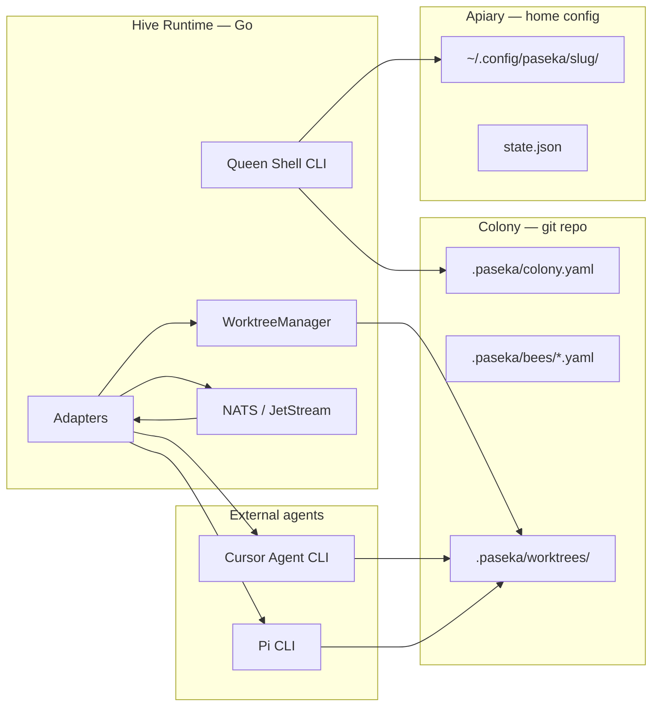

# Architecture: Colony, Configuration, Adapters

Paseka treats a **git repository** as the center of work. Every colony (project) has declarative config in the repo and machine-local state under the user's config directory.

---

## 1. Colony-centric model

| Concept | Location | Role |
| ------- | -------- | ---- |
| **Colony** | Git repo root | Source of truth for code, history, and shareable hive config |
| **Apiary** | Developer machine | Hosts Hive Runtime, NATS, and local adapter credentials |
| **Bee** | Config + runtime | A role (Scout, Guard, Builder…) bound to an **adapter** that drives an external agent |

The runtime never owns LLM logic. It **orchestrates** external tools via **adapters** — the **Cursor Agent CLI** (`agent`) and the **Pi CLI** (`pi`) — reads their output, and publishes results to the NATS bus as contract events.

---

## 2. Two-tier configuration

### Project-local: `.paseka/` (in repo)

Version-controlled colony definition. Safe to commit; no secrets.

```
.paseka/
├── colony.yaml          # colony manifest: bees, routes, defaults
├── bees/                # per-bee adapter bindings and non-secret params
│   ├── scout.yaml
│   └── builder.yaml
├── prompts/             # prompt templates (committed); see §2.1
│   ├── _partials/       # shared snippets (JSON contract, tone, etc.)
│   ├── scout.md
│   └── builder.md
├── .gitignore           # ignores worktrees/, runs/, cache/, *.local.yaml
├── runs/                # gitignored — per-agent file IPC (see §5.1)
│   └── <traceId>/
│       ├── <agentId>/
│       │   ├── prompt.txt
│       │   ├── result.txt
│       │   ├── meta.json
│       │   └── status.json
│       └── tasks/
│           └── <taskId>/
│               ├── task.md
│               └── runs.ndjson
└── worktrees/           # gitignored — isolated mutation workspaces
    └── <traceId>/
```

**`colony.yaml`** — colony identity, default branch, bee registry, NATS subject prefixes (optional overrides).

**`bees/*.yaml`** — maps a bee role to an adapter and parameters:

```yaml
# .paseka/bees/builder.yaml
role: builder
adapter: cursor
params:
  model: composer-2.5
  output_format: stream-json
  trust: true
  force: true
prompt_template: builder.md   # relative to .paseka/prompts/
worktree: true                  # run inside .paseka/worktrees/<traceId>/
subscribes:                     # optional — see docs/008-bee-routing.md
  - type: SIGNAL
    kind: task.ready
    dispatch: task
publishes:
  - type: MUTATION
    kind: code.proposal
```

Project-local overrides that must not be committed live in `*.local.yaml` (gitignored).

Bee event routing (`subscribes` / `publishes`) is documented in [008-bee-routing.md](008-bee-routing.md).

### 2.1 Prompt templates

Templates live in **`.paseka/prompts/`** — version-controlled, one colony, shareable across machines. Each bee references a template from its `bees/<role>.yaml`.

```
.paseka/prompts/
├── _partials/
│   ├── json-events.md      # «emit valid SIGNAL/INSIGHT JSON…»
│   └── result-file.md      # optional; runtime usually injects result path
├── scout.md
├── builder.md
└── guard.md
```

**Bee config → template:**

```yaml
# .paseka/bees/builder.yaml
role: builder
adapter: cursor
prompt_template: builder.md          # file under .paseka/prompts/
# prompt_template: scout.md           # reuse another bee's template
# prompt_template: _partials/foo.md   # usually avoid for top-level bees
worktree: true
```

**Rendering:** Go `text/template` at dispatch time. Runtime builds a **PromptContext** from bus event + colony state and writes the final string to `.paseka/runs/<traceId>/<agentId>/prompt.txt` before launching the adapter.

Available template fields (MVP):

| Field | Source |
| ----- | ------ |
| `{{.Bee}}` | role from bee config |
| `{{.TraceID}}` | current flight trail |
| `{{.AgentID}}` | this invocation |
| `{{.ColonyRoot}}` | git repo root |
| `{{.Workspace}}` | worktree or repo root (adapter cwd) |
| `{{.Task}}` | nectar / task body from event |
| `{{.Insights}}` | narrative INSIGHT events projected from prior runs on the trace (see [009-insight-kinds.md](009-insight-kinds.md)) |
| `{{.ResultFile}}` | absolute path to `result.txt` log artifact (runtime may write after the run) |

Example template:

```markdown
# .paseka/prompts/builder.md
You are Builder Bee for colony {{.ColonyRoot}}.

Flight trail: {{.TraceID}}

## Task
{{.Task}}

## Prior discoveries
{{range .Insights}}- {{.}}
{{end}}

Implement the task in the workspace. Follow existing code conventions.
```

**Partials** — include shared blocks to avoid duplication:

```markdown
{{template "json-events" .}}
```

Partials load from `.paseka/prompts/_partials/*.md` (filename without extension = template name).

**Overrides (precedence, highest wins):**

1. Inline `prompt:` in event / CLI `--prompt` (one-shot)
2. `bees/builder.local.yaml` → `prompt_template: my-builder.md` (gitignored via `*.local.yaml`)
3. `bees/builder.yaml` → `prompt_template`
4. `colony.yaml` → `defaults.prompt_template` (fallback for all bees)

Do **not** store prompts in `~/.config/paseka/` — they belong to the colony and should ride with the repo. Home config only holds secrets and runtime state.

**Bee Language vs technical:** UI/docs may say «Scout Bee»; templates can use bee tone for HITL readability. Bus payloads and JSON partials stay technical (`SIGNAL`, `traceId`, etc.) — see [002-paseka-glossary.md](002-paseka-glossary.md).

### Machine-local: `~/.config/paseka/<project-slug>/`

Per-colony state on this machine. Not committed.

```
~/.config/paseka/<project-slug>/
├── config.yaml          # secrets refs, NATS URL, adapter env
├── state.json           # runtime: active worktrees, last traceId, hive status
├── adapters/            # adapter-specific local overrides
│   ├── cursor.yaml      # CLI binary path, API key env
│   └── pi.yaml          # Pi CLI binary path, API key env
```

**Split rule:**

| Kind | Project `.paseka/` | Home `~/.config/paseka/<slug>/` |
| ---- | ------------------ | ------------------------------- |
| Bee roles & adapter choice | yes | — |
| Prompt templates (shareable) | yes | — |
| API keys, tokens | — | yes (or env var refs) |
| NATS connection override | — | yes |
| Active worktrees registry | pointer only | authoritative state |
| Active agent runs registry | pointer only | optional mirror in `state.json` |
| Event replay cache | — | yes |

---

## 3. Project slug

Stable identifier for the home config directory.

1. If `origin` remote exists → canonical slug from host/path (e.g. `github.com-acme-api` → `acme-api`, or full `github-com-acme-api`).
2. Else → sanitized directory name of repo root (e.g. `paseka`).
3. Collision on same machine → suffix with short hash of absolute repo path.

Stored in `.paseka/colony.yaml` as `slug` after first `paseka init` so later commands resolve the same home path.

---

## 4. `paseka init`

Run from inside a git repository (or at repo root).

```
paseka init
  │
  ├─► resolve git root (fail if not a repo)
  ├─► compute / persist project slug
  ├─► create .paseka/colony.yaml (defaults)
  ├─► create .paseka/prompts/ with starter templates (scout, builder)
  ├─► create .paseka/bees/ with starter bees (scout, builder)
  ├─► create .paseka/.gitignore (worktrees/, runs/, *.local.yaml, cache/)
  ├─► create ~/.config/paseka/<slug>/config.yaml
  ├─► create ~/.config/paseka/<slug>/state.json (empty)
  └─► print next steps (`agent login` or CURSOR_API_KEY, then `paseka run`)
```

`paseka init` is idempotent: existing files are preserved; missing pieces are added.

---

## 5. Agent adapters

An **adapter** is a thin driver: prepare workspace → invoke external tool → normalize result → emit bus events.

Paseka does **not** implement agents. It launches ready-made solutions with the right cwd, prompt, and parameters.

### Adapter interface (Go)

```go
type Adapter interface {
    Name() string
    Run(ctx context.Context, req RunRequest) (*RunResult, error)
}

type RunRequest struct {
    Bee        string
    Prompt     string
    ColonyRoot string            // git root — runs/ always under colony
    Workspace  string            // cwd for adapter (repo root or worktree)
    Params     RunParams
    TraceID    string            // flight trail for the whole task chain
    AgentID    string            // unique id per spawned agent
}

type RunResult struct {
    Status   string            // completed | failed | cancelled
    Output   string            // stdout / final assistant text
    Artifacts []Artifact       // diffs, logs, structured JSON
    ExitCode int
}
```

Adapters live under `internal/adapters/<name>/`. Registration is declarative via `adapter` field in bee config.

### 5.1 File-based agent IPC (`runs/`)

Each spawned agent gets an isolated directory under the **colony root** (not inside a worktree), so results survive worktree cleanup and multiple agents can share one `traceId`.

```
.paseka/runs/<traceId>/<agentId>/
├── prompt.txt         # runtime → agent: rendered prompt (audit / replay)
├── result.txt         # runtime log: human-readable summary (not a success contract)
├── meta.json          # runtime → observers: bee, adapter, workspace, startedAt
├── status.json        # runtime → observers: completed|failed, exitCode, finishedAt
├── session.json       # interactive only: pid, state, session metadata
└── transcript.ndjson  # interactive only: dialogue audit log
```

Task ledger projection (updated by `paseka run`):

```
.paseka/runs/<traceId>/tasks/<taskId>/
├── task.md            # markdown + YAML frontmatter task snapshot
└── runs.ndjson        # links task executions to agent run directories
```

| ID | Scope | Generated by |
| -- | ----- | ------------ |
| `traceId` | Whole flight trail — one bloom/nectar chain | runtime (`colony.NewTraceID`: `trace-` + 16 hex, time-ordered) |
| `agentId` | Single adapter invocation (one `agent` process) | runtime (random hex) |

**Why colony root, not worktree:** code edits happen in `.paseka/worktrees/<traceId>/`, but agent I/O and audit trail live in `.paseka/runs/<traceId>/<agentId>/`. Prompt uses an **absolute path** to `result.txt` so Cursor CLI writing from a worktree cwd still lands in the colony runs dir.

Entire `runs/` tree is **gitignored** — ephemeral, machine-local artifacts.

Implementation: `internal/runs/` prepares directories and files; adapters may still read legacy `result.txt` content for summary normalization, but run success no longer depends on it. Runtime auto-synthesizes `INSIGHT/run.summary` when policy allows. Domain events are published by agents through `paseka event emit --stdin`, not by parsing assistant stdout.

**Event publish path (MVP):**

```text
agent -> paseka event emit --stdin -> validation -> NATS/JetStream
```

Agents build one JSON object per event, pass it on stdin, and receive machine-readable validation/publish feedback. `events.ndjson` is the per-run audit log under `.paseka/runs/<traceId>/<agentId>/`; `paseka event emit` appends there after a successful publish when the event includes the correct `traceId` and `agentId`.

**Optional MCP layer:** a future MCP tool may wrap the same validation/publish backend used by `paseka event emit`. MCP is not required for the base contract.

### Example: Cursor adapter (CLI)

**Decision:** invoke the **Cursor Agent CLI** (`agent`), not the SDK. Prototype: `fizman-parent/scripts/ai-tasks-run.sh` (tmux wrapper → simplified in Go via `exec`).

| Input (bee config + event) | Maps to `agent` flag |
| ---------------------------- | -------------------- |
| `Workspace` | `--workspace <path>` (repo root or `.paseka/worktrees/<traceId>/`) |
| `Prompt` | positional prompt argument |
| `params.model` | `--model <id>` |
| `params.trust` (default true) | `--trust` |
| `params.force` (default true) | `--force` |
| `params.output_format` (default `stream-json`) | `--output-format stream-json` |
| `params.mode: plan` | `--plan` |
| API key | `CURSOR_API_KEY` env or `--api-key` from home config |

Default non-interactive invocation (same spirit as fizman script):

```bash
agent -p --trust --force \
  --workspace "$WORKSPACE" \
  --output-format stream-json \
  "$PROMPT"
```

**Result collection:**

1. **Process outcome** — adapter reports exit/cancel status; runtime may downgrade via `completion_contract` and per-bee `run_summary` policy.
2. **Run summary** — runtime auto-publishes `INSIGHT/run.summary` when allowed and missing; agents may emit it explicitly via `paseka event emit`.
3. **Log artifact** — runtime writes normalized summary to `result.txt` for human inspection.
4. **Git diff** — after `agent` exits, capture `git diff` in the **workspace** (worktree or repo root).
5. **Stream JSON** — stdout when `output_format: stream-json` (lifecycle/diagnostic parse only; domain events are not extracted from assistant text).
6. **status.json** — runtime records exit code and outcome for `paseka inspect` / Queen Console.

Go implementation: `internal/adapters/cursor/` runs `agent` with `exec.CommandContext` (no tmux — process wait replaces the shell's `tmux wait-for` pattern).

Optional: Cursor's built-in `--worktree` flag exists but Paseka prefers **`.paseka/worktrees/<traceId>/`** under colony control for HITL merge/reject.

### Example: Pi adapter (CLI)

**Decision:** invoke the **Pi CLI** (`pi`) for bees configured with `adapter: pi`. AFK runs use `pi -p`; interactive sessions use `pi` under a Paseka-owned PTY (see [006-interactive-sessions.md](006-interactive-sessions.md)).

| Input (bee config + event) | Maps to `pi` flag |
| ---------------------------- | ----------------- |
| `Workspace` | process cwd |
| `Prompt` | positional prompt argument |
| `params.model` | `--model <pattern>` |
| `params.provider` | `--provider <name>` |
| `params.thinking` | `--thinking <level>` |
| `params.output_format` | `--mode <mode>` (AFK only; see below) |
| `params.plan` | `--plan` |
| `params.binary` | CLI binary name (default `pi`) |
| API key | `api_key_env` from `~/.config/paseka/<slug>/adapters/pi.yaml` → `--api-key` |

**`output_format` → `--mode` (AFK only):**

| `params.output_format` | Pi `--mode` |
| ---------------------- | ----------- |
| `text` | `text` |
| `json` | `json` |
| `rpc` | `rpc` |
| empty or any other value | `json` (default) |

Default non-interactive invocation:

```bash
pi -p --mode json \
  --model "$MODEL" \
  --provider "$PROVIDER" \
  "$PROMPT"
```

**Ignored params:** Pi does not map Paseka `trust` or `force` (no equivalent flags).

**Result collection:**

1. **Process outcome** — adapter reports exit/cancel status; runtime may downgrade via `completion_contract` and per-bee `run_summary` policy.
2. **Run summary** — runtime auto-publishes `INSIGHT/run.summary` when allowed and missing; agents may emit it explicitly via `paseka event emit`.
3. **Log artifact** — runtime writes normalized summary to `result.txt` for human inspection.
4. **Git diff** — after `pi` exits, capture `git diff` in the **workspace** (worktree or repo root).
5. **Stdout** — raw stdout is preserved as an artifact. In `json`/`rpc` modes the adapter tolerantly extracts a human summary from common JSON fields (`summary`, `output`, `text`, etc.) for `result.txt` only.
6. **status.json** — runtime records exit code and outcome for `paseka inspect` / Queen Console.

**Event publishing boundary:** Pi stdout/JSON is **not** parsed into domain bus events (`SIGNAL`, `INSIGHT`, `MUTATION`, `VERIFICATION`). Agents must publish domain events explicitly via `paseka event emit --stdin` — same contract as Cursor.

**Machine-local config** (`~/.config/paseka/<slug>/adapters/pi.yaml`):

```yaml
binary: pi
api_key_env: GEMINI_API_KEY   # optional; passed as --api-key when set in env
```

If the file is missing, defaults are `binary: pi` and no API key injection.

Example bee config:

```yaml
# .paseka/bees/scout.yaml
role: scout
adapter: pi
params:
  model: gemini-2.5-pro
  provider: google
  thinking: high
  output_format: json
prompt_template: scout.md
```

Go implementation: `internal/adapters/pi/`.

Future adapters (same contract): `claude-code`, `aider`, custom shell.

### 5.2 Interactive sessions (HITL)

For human-in-the-loop dialogue, Paseka uses a **parallel** session path alongside one-shot `Adapter.Run()`. See [006-interactive-sessions.md](006-interactive-sessions.md).

| Mode | CLI | Adapter API |
| ---- | --- | ----------- |
| AFK | `paseka bee run <role>` | `Adapter.Run()` — Cursor: `agent -p`; Pi: `pi -p` |
| Interactive | `paseka bee chat <role>` | `SessionAdapter.SessionCommand()` — Cursor: `agent` without `-p`; Pi: `pi` without `-p`/`--mode`, PTY-owned by runtime |

Interactive runs add `session.json` and `transcript.ndjson` under the same `.paseka/runs/<traceId>/<agentId>/` tree. Active sessions are registered in `~/.config/paseka/<slug>/state.json`. Terminal UI (default terminal vs Ghostty) is configured in `~/.config/paseka/<slug>/terminal.yaml`.

---

## 6. Worktrees

Isolated mutations avoid touching the working tree until human approval (Queen Console / HITL).

```
SIGNAL / INSIGHT on bus
        │
        ▼
  Bee assigned (e.g. builder + worktree: true)
        │
        ▼
  WorktreeManager.Create(traceId, baseBranch)
        │  → .paseka/worktrees/<traceId>/  (gitignored)
        ▼
  Adapter.Run(Workspace = worktree path)
        │
        ▼
  Capture git diff(worktree vs base)
        │
        ▼
  Publish MUTATION { traceId, diff, summary }
        │
        ▼
  Human review → approve (merge) | reject (remove worktree)
```

**Default location:** `.paseka/worktrees/<traceId>/` — colocated with colony, simple paths for adapters, listed in `.gitignore`.

**Registry:** `~/.config/paseka/<slug>/state.json` tracks active worktrees, base SHA, branch, and linked `traceId` for cleanup on `paseka doctor`.

Commands (later): `paseka worktree list`, `paseka worktree clean`.

---

## 7. End-to-end flow

A single `traceId` may contain multiple tasks (`taskId`) managed by the Task Ledger. See [005-task-ledger.md](005-task-ledger.md) for the `task.plan → task.ready → task.completed` protocol.



---

## 8. Package layout (target)

```
cmd/paseka/                 # Queen Shell
internal/
  colony/                   # load .paseka + home config, slug resolution
  prompts/                  # load + render .paseka/prompts/*.md templates
  runs/                     # .paseka/runs/<traceId>/<agentId>/ layout + meta/status
  adapters/                 # adapter registry + cursor/, pi/, …
  sessions/                 # interactive PTY sessions, terminal attach
  worktree/                 # create, diff, merge, cleanup
  bus/                      # NATS, message contracts
  runtime/                  # dispatch: colony → prompts → adapter (AFK)
```

---

## 9. Decisions (locked)

| Topic | Decision |
| ----- | -------- |
| Worktree path | `.paseka/worktrees/<traceId>/` — colony-managed; registry in home `state.json` |
| Cursor invocation | Cursor Agent CLI (`agent`) — port of `ai-tasks-run.sh` pattern |
| Pi invocation | Pi CLI (`pi`) — AFK `pi -p`, interactive PTY; see §5.1 Pi adapter |
| Supported adapters | `cursor` (default), `pi` — selected per bee via `adapter:` in `bees/*.yaml` |
| Agent run IPC | `.paseka/runs/<traceId>/<agentId>/` — file-based; entire `runs/` gitignored |
| Prompt templates | `.paseka/prompts/` — committed; bee YAML references by filename |
| Commit `.paseka/` | yes by default; `.gitignore` covers `worktrees/`, `runs/`, `*.local.yaml`, `cache/` |
| Slug in colony.yaml | written at `paseka init`, reused on every run |
| Interactive sessions | separate `SessionAdapter`; PTY in `internal/sessions/`; see [006-interactive-sessions.md](006-interactive-sessions.md) |
| Terminal UI for HITL | `~/.config/paseka/<slug>/terminal.yaml` — `default` or `ghostty` |

### `.paseka/.gitignore` (created by `paseka init`)

```
worktrees/
runs/
*.local.yaml
cache/
```
