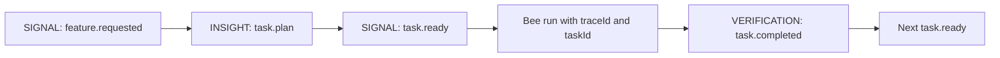

# Task Ledger Protocol

Paseka models a feature flow as a **trace** (`traceId`) containing one or more **tasks** (`taskId`). Each task may spawn one or more **agent runs** (`agentId`). The Task Ledger is the projected state of all tasks within a trace.

Implementation: [`internal/protocol/task.go`](../internal/protocol/task.go), [`internal/taskledger`](../internal/taskledger/).

---

## 1. Identifiers

| ID | Scope | Meaning |
| -- | ----- | ------- |
| `traceId` | Whole feature / PRD / bloom | One flight trail from initial signal through PR/merge |
| `taskId` | One subtask within a trace | A unit of work in the task queue (nectar) |
| `agentId` | One adapter invocation | A single bee run (Cursor CLI process) |

Auto-generated `traceId` values use a compact time-ordered format: `trace-` + 16 lowercase hex chars (48-bit UTC ms + 16-bit random). Lexicographic sort matches creation order. Manual ids via `--trace` (e.g. `trace-auth-01`) are allowed and need not follow this layout. See [`internal/colony/traceid.go`](../internal/colony/traceid.go).

Relationship:

```text
traceId
  └── task-1
  │     └── agentId-a (builder run)
  │     └── agentId-b (guard run)
  └── task-2
        └── agentId-c (builder run)
```

**Important:** `RunStatus` (`completed`, `failed`, …) on an agent run is **not** the same as task completion. A task is complete only after the review/commit gate emits `task.completed`.

---

## 2. Task lifecycle



| Status | Meaning |
| ------ | ------- |
| `planned` | Task registered from `task.plan`; waiting on dependencies |
| `ready` | Dependencies satisfied; eligible for dispatch |
| `running` | Bee dispatched for this task |
| `waiting_review` | Code changed; awaiting guard/HITL |
| `completed` | Review/commit gate passed |
| `failed` | Task abandoned or rejected |
| `blocked` | Cannot proceed (manual intervention) |

Task lifecycle events use `payload.kind` inside existing top-level event types — no new `EventType` values.

---

## 3. Event contract

### `task.plan` — INSIGHT

Scout (or planner bee) publishes a breakdown after analyzing the initial signal.

```json
{
  "traceId": "trace-auth-01",
  "type": "INSIGHT",
  "payload": {
    "kind": "task.plan",
    "tasks": [
      {
        "taskId": "task-1",
        "title": "Add backend endpoint",
        "body": "POST /api/auth/login with JWT",
        "bee": "builder",
        "dependsOn": []
      },
      {
        "taskId": "task-2",
        "title": "Add login UI",
        "body": "Login form component",
        "bee": "builder",
        "dependsOn": ["task-1"]
      }
    ]
  }
}
```

### `task.ready` — SIGNAL

Runtime or Task Reactor marks a task as ready for dispatch. Emitted when:

- A task has no dependencies and is first in the queue, or
- All `dependsOn` tasks have `status: completed`.

```json
{
  "traceId": "trace-auth-01",
  "type": "SIGNAL",
  "payload": {
    "kind": "task.ready",
    "taskId": "task-1",
    "title": "Add backend endpoint",
    "body": "POST /api/auth/login with JWT",
    "bee": "builder"
  }
}
```

### `task.completed` — VERIFICATION

Task passed the AFK gate: implement → review → commit. Use `VERIFICATION` (not agent `RunStatus`) because completion is a verified domain fact.

```json
{
  "traceId": "trace-auth-01",
  "type": "VERIFICATION",
  "payload": {
    "kind": "task.completed",
    "taskId": "task-1",
    "status": "completed",
    "summary": "Endpoint implemented, reviewed, committed",
    "commit": "abc123def",
    "completedAt": "2026-07-05T08:30:00Z"
  }
}
```

After `task.completed`, the ledger unlocks dependent tasks and may emit `task.ready` for the next item.

---

## 4. End-to-end feature flow

```text
PRD (SIGNAL: feature.requested)
  → Scout INSIGHT task.plan
  → Task Reactor: task-1 → ready
  → Builder run (traceId + taskId)
  → Guard review
  → Commit
  → VERIFICATION task.completed task-1
  → Task Reactor: task-2 → ready
  → … repeat …
  → All tasks completed
  → PR / merge / HITL
```

---

## 5. Ledger interface

The `taskledger.Ledger` interface defines how trace state is stored and updated:

```go
type Ledger interface {
    Snapshot(traceID string) (TraceSnapshot, error)
    Apply(event protocol.Event) (ApplyResult, error)
}
```

**Current scope:** protocol types, pure reducer (`taskledger.ApplyEvent`), in-memory ledger for tests, and JetStream KV ledger (`taskledger.KVLedger`) used by `paseka run`. See [008-bee-routing.md](008-bee-routing.md) for declarative bee subscriptions.

`ApplyResult.Ready` lists tasks that newly transitioned to `ready` after applying an event — the hook for a future scheduler to dispatch the next bee.

---

## 6. Runtime integration (MVP)

| Field | Where | Notes |
| ----- | ----- | ----- |
| `taskId` | `protocol.Request`, `adapters.RunRequest`, `prompts.Context` | Optional; empty for one-shot CLI runs |
| `{{.TaskID}}` | Prompt templates | Available when dispatch includes a task id |
| Task events | `paseka event emit --stdin` | Validated CLI publish with machine-readable feedback |

CLI behavior is unchanged when `taskId` is omitted.

---

## 6.1 Filesystem task projection

The runtime mirrors each trace task into `.paseka/runs/<traceId>/tasks/<taskId>/` as a **projection** of JetStream KV state (not a second source of truth).

```text
.paseka/runs/<traceId>/
  tasks/
    <taskId>/
      task.md        # markdown + YAML frontmatter snapshot
      runs.ndjson    # agent run history for this task
```

`task.md` frontmatter stores machine-readable fields (`traceId`, `taskId`, `title`, `bee`, `status`, `dependsOn`, `summary`, `commit`, `updatedAt`). The markdown body stores the human-readable task description (`body`).

`runs.ndjson` links task executions to existing agent run directories (`agentId`, `bee`, `runDir`, `startedAt`, `finishedAt`, `runStatus`).

The hive runtime updates this projection after `ledger.Apply(...)` and when task-queue dispatches start or finish.

For human-friendly task injection from the CLI, use `paseka task create` to publish `task.plan` (and optionally `task.ready` with `--autorun`). See [007-cli.md](007-cli.md).

---

## 7. Related docs

- [003-architecture.md](003-architecture.md) — colony layout, adapter contract, worktrees
- [004-prompt-templates.md](004-prompt-templates.md) — template variables including `TaskID`
- [002-paseka-glossary.md](002-paseka-glossary.md) — Task/Nectar, TraceID/Flight Trail
