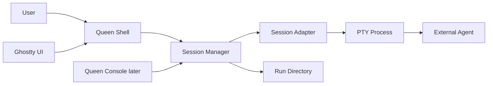

# Interactive Agent Sessions (HITL)

Paseka supports two ways to run a bee:

| Mode | CLI | Use case |
| ---- | --- | -------- |
| **AFK (one-shot)** | `paseka bee run <role> --task "…"` | Background work; runtime waits for exit and collects `result.txt` / diff |
| **Interactive (session)** | `paseka bee chat <role> "…"` | Human-in-the-loop dialogue in one long-lived agent process |

Interactive sessions are a **parallel runtime path**. They do not change the existing `Adapter.Run()` contract used for AFK runs.

See also: [003-architecture.md](003-architecture.md) (adapters, runs layout), [001-brief.md](001-brief.md) (HITL paradigm).

---

## 1. Architecture



**Core rules:**

- `Adapter.Run()` stays synchronous and non-interactive (`agent -p` for Cursor).
- `SessionAdapter` only describes **how to launch** the external tool; the runtime owns the PTY, lifecycle, transcript, and status files.
- Ghostty is an optional **attach UI**, not the session primitive. Terminal preferences live in machine-local config, not in committed `.paseka/`.

**Packages:**

| Package | Role |
| ------- | ---- |
| `internal/adapters` | `SessionAdapter`, `SessionRequest`, `SessionHandle` |
| `internal/adapters/cursor` | Interactive `agent` invocation (no `-p`) |
| `internal/sessions` | PTY process, attach, registry, Ghostty launcher |
| `internal/runs` | `session.json`, `transcript.ndjson` |
| `internal/colony` | Session registry in `state.json`, `terminal.yaml` |

---

## 2. Session adapter interface

```go
type SessionAdapter interface {
    Name() string
    SessionCommand(req SessionRequest) (SessionCommand, error)
}
```

`SessionCommand` is a plain `exec` spec: binary, args, env, working directory. The session manager starts it inside a PTY.

AFK adapters keep the existing interface:

```go
type Adapter interface {
    Name() string
    Run(ctx context.Context, req RunRequest) (*RunResult, error)
}
```

---

## 3. Run directory layout

Interactive sessions reuse `.paseka/runs/<traceId>/<agentId>/` under the **colony root** (same as AFK runs). Additional files:

```
.paseka/runs/<traceId>/<agentId>/
├── prompt.txt
├── result.txt
├── meta.json
├── status.json
├── request.json
├── events.ndjson
├── session.json        # live session metadata (PID, state, workspace)
└── transcript.ndjson   # NDJSON log of user/agent/system turns
```

| File | Purpose |
| ---- | ------- |
| `session.json` | `sessionId`, `traceId`, `pid`, `state` (`active` → `completed` / `failed` / `cancelled`) |
| `transcript.ndjson` | Audit trail for dialogue (`role`: `user` \| `agent` \| `system`) |

`sessionId` equals `agentId` in the MVP.

---

## 4. Session registry

Active sessions are mirrored in machine-local state:

```
~/.config/paseka/<slug>/state.json
```

```json
{
  "sessions": [
    {
      "sessionId": "a1b2c3d4",
      "traceId": "trace-…",
      "agentId": "a1b2c3d4",
      "runDir": "/path/to/repo/.paseka/runs/trace-…/a1b2c3d4",
      "bee": "scout",
      "pid": 12345,
      "startedAt": "2026-07-05T09:00:00Z"
    }
  ]
}
```

Entries are removed when the session exits. `paseka session stop` can signal the recorded PID if the session is not owned by the current shell process.

---

## 5. Queen Shell commands

### Start a chat

```bash
# Interactive session in the current terminal
paseka bee chat scout "help me design the auth flow"

# Task via template instead of positional prompt
paseka bee chat builder --task "add retry logic to the NATS client"

# Reuse a trace (e.g. continue work in the same worktree)
paseka bee chat builder --trace trace-abc123 --task "finish the PR"
```

### Session management

```bash
paseka session list              # sessions from state.json
paseka session attach <sessionId>  # attach PTY in this process only
paseka session stop <sessionId>    # stop local or remote (by PID)
```

`session attach` only works for sessions started in the **same** `paseka` process. For a separate window, use Ghostty (below) or start the session there directly.

### AFK vs chat

```bash
paseka bee run scout --task "survey the repo"   # non-interactive, exits when done
paseka bee chat scout "let's discuss the repo"  # interactive PTY session
```

---

## 6. Terminal configuration (Ghostty)

Terminal UI choice is **machine-local**:

```
~/.config/paseka/<slug>/terminal.yaml
```

```yaml
terminal: ghostty       # default | ghostty
ghostty_binary: ghostty # optional override
```

CLI override:

```bash
paseka bee chat scout "hello" --terminal ghostty
```

**Behavior:**

| `terminal` | What happens |
| ------------ | -------------- |
| `default` (or unset) | Session runs and attaches in the **current** terminal |
| `ghostty` | Opens a Ghostty window running `paseka session run <role> …` — the full session lives in that window |

Ghostty does not own the agent process in the default path: Paseka starts the PTY and attaches stdin/stdout. With Ghostty, the child `paseka session run` process owns the PTY inside the new window.

If Ghostty is not installed, set `terminal: default` or omit `terminal.yaml`.

---

## 7. Cursor adapter (interactive)

| Input | Maps to `agent` |
| ----- | --------------- |
| `Workspace` | `--workspace <path>` |
| `InitialPrompt` | positional prompt (no `-p`) |
| `params.model` | `--model <id>` |
| `params.force` | `--force` |
| `params.plan` | `--plan` |
| API key | `CURSOR_API_KEY` or `--api-key` from home config |

Interactive invocation:

```bash
agent --force \
  --workspace "$WORKSPACE" \
  --model composer-2.5 \
  "$PROMPT"
```

Worktrees: if the bee has `worktree: true`, the session cwd is `.paseka/worktrees/<traceId>/` (same as `bee run`).

---

## 8. Lifecycle

```
paseka bee chat <role> [prompt]
        │
        ▼
  Resolve colony + bee config
        │
        ▼
  Optional worktree for traceId
        │
        ▼
  Render prompt → prompt.txt
        │
        ▼
  SessionAdapter.SessionCommand()
        │
        ▼
  Start PTY process → write session.json (active)
        │
        ▼
  Register in state.json
        │
        ▼
  Attach terminal (current or Ghostty)
        │
        ▼
  User dialogues with agent in one process
        │
        ▼
  On exit → update session.json, status.json, transcript
        │
        ▼
  Unregister from state.json
```

---

## 9. MVP limitations and next steps

| Topic | MVP | Later |
| ----- | --- | ----- |
| Cross-process attach | `session attach` same process only; use Ghostty for new window | Unix socket / WebSocket relay for Queen Console |
| `SessionAdapter.Send` | Full PTY passthrough; no separate send API | Structured message API for web UI |
| Bee YAML `mode: interactive` | Use `bee chat` explicitly | Optional default per bee |
| NATS events | File-based audit only | Publish session lifecycle to bus |

---

## 10. Decisions (locked)

| Topic | Decision |
| ----- | -------- |
| Session vs AFK | Separate `SessionAdapter`; do not overload `Adapter.Run()` |
| Session ID | Same as `agentId` for MVP |
| Run dir | `.paseka/runs/<traceId>/<agentId>/` — shared with AFK IPC |
| Terminal config | `~/.config/paseka/<slug>/terminal.yaml` — not committed |
| Ghostty | Optional UI; `session run` runs full session inside Ghostty window |
