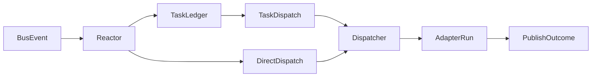

# Bee event routing

Declarative `subscribes` and `publishes` in `.paseka/bees/<role>.yaml` describe how bees participate in choreographed bus flows without giving each bee its own NATS consumer.

Implementation: [`internal/colony/routing.go`](../internal/colony/routing.go), [`internal/runtime/reactor.go`](../internal/runtime/reactor.go).

---

## 1. Principles

- **One reactor** — `paseka run` keeps a single JetStream consumer (`Reactor`) that applies routing rules from all bee configs.
- **Task ledger stays canonical** — `task.plan` → `task.ready` → `task.completed` still drives dependency-aware work queues.
- **Hybrid dispatch** — some subscriptions trigger task-ledger dispatches; others trigger **direct** bee runs on domain events (e.g. code review).
- **Advisory publishes** — `publishes` documents expected output; runtime logs warnings for undeclared domain events but does not block them (MVP).
- **Role vs intent** — routing selects the bee role (`builder`, `guard`, …). Optional `intent` on tasks tunes prompt guidance inside a role without creating separate bees.

---

## 2. Config shape

Each rule matches bus events by **top-level `type`** (`SIGNAL`, `INSIGHT`, `MUTATION`, `VERIFICATION`) and optional **`payload.kind`**.

```yaml
# .paseka/bees/builder.yaml
subscribes:
  - type: SIGNAL
    kind: task.ready
    dispatch: task
  - type: VERIFICATION
    kind: verification.failed
    dispatch: direct
publishes:
  - type: MUTATION
    kind: code.proposal
  - type: VERIFICATION
    kind: task.completed
```

```yaml
# .paseka/bees/guard.yaml
subscribes:
  - type: MUTATION
    kind: code.proposal
    dispatch: direct
publishes:
  - type: VERIFICATION
    kind: verification.success
  - type: VERIFICATION
    kind: verification.failed
```

### Fields

| Field | Meaning |
| ----- | ------- |
| `type` | `protocol.EventType` published on the bus |
| `kind` | `payload.kind` inside the event JSON (optional wildcard when omitted) |
| `dispatch` | `task` — capability for task-ledger dispatches; `direct` — reactor runs this bee when the event arrives |

If `dispatch` is omitted:

- `task.*` kinds default to `task`
- other kinds default to `direct`

### Backward compatibility

Bees **without** `subscribes` behave as before: any `task.ready` dispatch is allowed.

---

## 3. NATS subject mapping

Subjects follow [`internal/bus/subject.go`](../internal/bus/subject.go):

```text
<prefix>.events.<EventType>[.<payload.kind>]
```

Examples:

- `paseka.demo.events.SIGNAL.task.ready`
- `paseka.demo.events.MUTATION.code.proposal`
- `paseka.demo.events.VERIFICATION.verification.failed`

Routing matches on parsed event `type` + `payload.kind`, not on raw subject strings.

---

## 4. Runtime flow



### Task path

1. `INSIGHT/task.plan` registers tasks in the ledger.
2. `SIGNAL/task.ready` (or dependency unlock after `task.completed`) marks tasks ready.
3. Reactor dispatches the bee named in `task.Bee` **only if** that bee subscribes to `task.ready` (or has no `subscribes` block).
4. On successful run, reactor publishes `VERIFICATION/task.completed`.

### Direct path

When a domain event arrives, reactor finds all bees with `dispatch: direct` subscriptions and runs them with context derived from the event payload:

| Event | Typical bee | Task context |
| ----- | ----------- | ------------ |
| `MUTATION/code.proposal` | `guard` | diff + summary for review |
| `VERIFICATION/verification.failed` | `builder` | failure summary for fix-up |
| `VERIFICATION/verification.success` | `receiver` | approval summary for commit gate |

Duplicate runs are suppressed per `traceId + taskId + bee + type + kind`.

---

## 5. Advisory publishes

After an adapter run, `Dispatcher.publishRunOutcome` compares emitted domain events against `bee.publishes`:

- **Declared** — no action
- **Undeclared** — log warning + append to `RunResult.Warnings`
- Events are still published (no enforcement in MVP)

Auto-generated `MUTATION/code.proposal` from workspace diffs is published **only** when the bee declares it in `publishes` (typically `builder`). Reviewer bees like `guard` run `git diff` for artifacts but do not emit a bus mutation unless they declare one.

Runtime may also auto-publish `INSIGHT/run.summary` after successful AFK runs when the bee `run_summary` policy allows (`auto` by default). Set `run_summary: disabled` to skip synthesis or `run_summary: required` to fail the run when no summary event is present.

```yaml
# .paseka/bees/builder.yaml
run_summary: auto   # auto | required | disabled
```

---

## 6. Completion contracts

Bees may declare required post-run domain events via `completion_contract` in `bees/<role>.yaml`. Runtime validates `events.ndjson` after the adapter exits and marks the run **failed** when the contract is violated, even if the process completed successfully.

Example for `guard`:

```yaml
completion_contract:
  required:
    - type: VERIFICATION
      kind_one_of:
        - verification.success
        - verification.failed
      count: 1
```

Narrative `INSIGHT` events are optional and do not satisfy completion contracts. See [009-insight-kinds.md](009-insight-kinds.md).

---

## 7. Related docs

- [005-task-ledger.md](005-task-ledger.md) — task lifecycle events
- [003-architecture.md](003-architecture.md) — colony layout and adapters
- [009-insight-kinds.md](009-insight-kinds.md) — INSIGHT taxonomy and prompt memory projection
