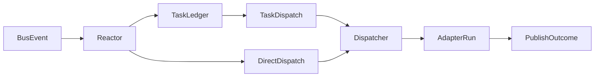

# Bee event routing

Declarative `subscribes` and `publishes` in `.paseka/bees/<role>.yaml` describe how bees participate in choreographed bus flows without giving each bee its own NATS consumer.

Implementation: [`internal/colony/routing.go`](../internal/colony/routing.go), [`internal/runtime/reactor.go`](../internal/runtime/reactor.go).

For a static graph of how these rules connect in your colony config, see [spec 007: Colony EDA Topology](specs/007-colony-eda-topology.md) (Queen Console **Topology** tab and `paseka colony topology`) — observability only; routing semantics remain in this doc.

---

## 1. Principles

- **One reactor** — `paseka run` keeps a single JetStream consumer (`Reactor`) that applies routing rules from all bee configs.
- **Task ledger stays canonical** — `task.plan` → `task.ready` → `task.completed` still drives dependency-aware work queues.
- **Hybrid dispatch** — some subscriptions trigger task-ledger dispatches; others trigger **direct** bee runs on domain events (e.g. code review).
- **Advisory publishes** — `publishes` documents expected output; runtime logs warnings for undeclared domain events but does not block them (MVP).
- **Role vs intent** — routing selects the bee role (`builder`, `guard`, …). Optional `intent` on tasks tunes prompt guidance inside a role without creating separate bees.

---

## 2. Config shape

Each rule matches bus events by **top-level `type`** (`SIGNAL`, `INSIGHT`, `MUTATION`, `VERIFICATION`) and optional **`payload.kind`**.

```yaml
# .paseka/bees/builder.yaml
subscribes:
  - type: SIGNAL
    kind: task.ready
    dispatch: task
  - type: VERIFICATION
    kind: verification.failed
    dispatch: direct
publishes:
  - type: MUTATION
    kind: code.proposal
  - type: VERIFICATION
    kind: task.completed
```

```yaml
# .paseka/bees/guard.yaml
subscribes:
  - type: MUTATION
    kind: code.proposal
    dispatch: direct
publishes:
  - type: VERIFICATION
    kind: verification.success
  - type: VERIFICATION
    kind: verification.failed
```

### Fields

| Field | Meaning |
| ----- | ------- |
| `type` | `protocol.EventType` published on the bus |
| `kind` | `payload.kind` inside the event JSON (optional wildcard when omitted) |
| `dispatch` | `task` — capability for task-ledger dispatches; `direct` — reactor runs this bee when the event arrives |

If `dispatch` is omitted:

- `task.*` kinds default to `task`
- other kinds default to `direct`

### Backward compatibility

Bees **without** `subscribes` behave as before: any `task.ready` dispatch is allowed.

---

## 3. NATS subject mapping

Subjects follow [`internal/bus/subject.go`](../internal/bus/subject.go):

```text
<prefix>.events.<EventType>[.<payload.kind>]
```

Examples:

- `paseka.demo.events.SIGNAL.task.ready`
- `paseka.demo.events.MUTATION.code.proposal`
- `paseka.demo.events.VERIFICATION.verification.failed`

Routing matches on parsed event `type` + `payload.kind`, not on raw subject strings.

---

## 4. Runtime flow



### Task path

1. `INSIGHT/task.plan` registers tasks in the ledger.
2. `SIGNAL/task.ready` (or dependency unlock after `task.completed`) marks tasks ready.
3. Reactor dispatches the bee named in `task.Bee` **only if** that bee subscribes to `task.ready` (or has no `subscribes` block).
4. On successful run with `review: none`:
   - If the run already emitted `VERIFICATION/task.completed`, apply it.
   - Else if a colony bee explicitly declares `publishes: VERIFICATION/task.completed` **and** this run opened `MUTATION/code.proposal` (emitted event, or non-empty diff with explicit `code.proposal` on the dispatched bee), set `waiting_review` and wait for the commit-gate publisher (typically receiver).
   - Else runtime publishes `VERIFICATION/task.completed` (fallback for scout, no-diff runs, colonies without a commit-gate publisher).

### Direct path

When a domain event arrives, reactor finds all bees with `dispatch: direct` subscriptions and runs them with context derived from the event payload:

| Event | Typical bee | Task context |
| ----- | ----------- | ------------ |
| `MUTATION/code.proposal` | `guard` | diff + summary for review |
| `VERIFICATION/verification.failed` | `builder` | failure summary for fix-up |
| `VERIFICATION/verification.success` | `receiver` | approval summary for commit gate |

Duplicate runs are suppressed per `traceId + taskId + bee + type + kind` when `payload.taskId` is set. Direct dispatch also skips when the publishing run's bee role matches the subscriber (prevents receiver self-loops if it mistakenly re-emits `verification.success`).

---

## 5. Advisory publishes

After an adapter run, `Dispatcher.publishRunOutcome` compares emitted domain events against `bee.publishes`:

- **Declared** — no action
- **Undeclared** — log warning + append to `RunResult.Warnings`
- Events are still published (no enforcement in MVP)

Auto-generated `MUTATION/code.proposal` from workspace diffs is published **only** when the bee declares it in `publishes` (typically `builder`). Reviewer bees like `guard` run `git diff` for artifacts but do not emit a bus mutation unless they declare one.

Runtime may also auto-publish `INSIGHT/run.summary` after successful AFK runs when the bee `run_summary` policy allows (`auto` by default). Set `run_summary: disabled` to skip synthesis or `run_summary: required` to fail the run when no summary event is present.

```yaml
# .paseka/bees/builder.yaml
run_summary: auto   # auto | required | disabled
```

---

## 6. Completion contracts

Bees may declare required post-run domain events via `completion_contract` in `bees/<role>.yaml`. Runtime validates `events.ndjson` after the adapter exits and marks the run **failed** when the contract is violated, even if the process completed successfully.

Example for `guard`:

```yaml
completion_contract:
  required:
    - type: VERIFICATION
      kind_one_of:
        - verification.success
        - verification.failed
      count: 1
```

Narrative `INSIGHT` events are optional and do not satisfy completion contracts. See [009-insight-kinds.md](009-insight-kinds.md).

---

## 7. Colony `auto_invites` (Human Gateway)

Bee `subscribes` imply `Adapter.Run()` dispatch. **Auto-invite** is separate colony choreography: when a bus event matches, `paseka run` publishes a pending `session.invite` for Beekeeper accept/reject.

**`payload.decision` vs routing:** On colony events (e.g. `feature.classified`), `payload.decision` is a **classification tag** on the branch (`grill`, `plan`, …). Colony rules may match it via `auto_invites.match.decision`. That is distinct from (1) bee **`subscribes`** dispatch (`type` + `payload.kind` → AFK run) and (2) glossary **Flight Route** — the NATS subject (`events.<EventType>[.<kind>]`, §3). See [specs/005-feature-ideation-flow.md](specs/005-feature-ideation-flow.md).

Rules live in **`.paseka/colony.yaml`** (not bee YAML). Implementation: [`internal/colony/invite_rules.go`](../internal/colony/invite_rules.go), [`internal/invites/auto_invite.go`](../internal/invites/auto_invite.go), [`internal/runtime/invite_publisher.go`](../internal/runtime/invite_publisher.go).

```yaml
auto_invites:
  - when:
      type: SIGNAL
      kind: feature.classified
    match:
      decision: grill
    invite:
      bee: { default: drone }
      intent: { default: grilling }
      task:
        from_trace_kind: feature.requested
        from_trace_field: title
        prefix: "Grill feature: "
        fallback_from: rationale
        default: Grill feature
      status: pending
      done_when:
        when: { type: SIGNAL, kind: spec.ready }
        require_file: { from: ref }
        set_artifact_ref: { from: ref }
    dedupe: [bee, intent]
  - when:
      type: SIGNAL
      kind: spec.ready
    invite:
      bee: { default: drone }
      intent: { default: breakdown }
      artifactRef: { from: ref }
      task: { from: ref, prefix: "Break down ", default: Break down spec }
      status: pending
    dedupe: [intent, artifactRef]
```

| Field | Meaning |
| ----- | ------- |
| `when` | Same as bee `subscribes`: `type` + optional `kind` |
| `match` | AND equality on top-level payload string fields |
| `invite.*.from` / `default` | Copy string from trigger payload or fallback |
| `invite.task.from_trace_*` | Latest prior trace event with that `kind`; read field |
| `invite.task.fallback_from` | Field on trigger payload if trace lookup fails |
| `invite.done_when` | Optional completion contract persisted on the invite (see §8) |
| `dedupe` | Skip when a **pending** invite on the trace matches those invite fields |

`paseka init` seeds the grill and breakdown rules above (feature ideation reference). With **empty** `auto_invites`, no auto-invite runs. See [specs/005-feature-ideation-flow.md](specs/005-feature-ideation-flow.md) and [specs/006-human-gateway-invites.md](specs/006-human-gateway-invites.md).

---

## 8. Invite `done_when` (completion contract)

An invite is a **work contract**: required `task` (input) plus optional `done_when` (expected result). When a bus event matches a persisted invite's `done_when`, `paseka run` updates that invite by `inviteId` to `completed` (file exists at `ref`) or `incomplete` (missing file). Implementation: [`internal/invites/completion.go`](../internal/invites/completion.go), [`internal/runtime/invite_completer.go`](../internal/runtime/invite_completer.go).

```yaml
invite:
  task: { ... }
  done_when:
    when: { type: SIGNAL, kind: spec.ready }
    match: { optional: equality }
    require_file: { from: ref }
    set_artifact_ref: { from: ref }
```

| Field | Meaning |
| ----- | ------- |
| `done_when.when` | Same as `auto_invites.when`: `type` + optional `kind` |
| `done_when.match` | Optional AND equality on trigger payload string fields |
| `done_when.require_file.from` | Payload field with repo-relative path; file must exist under colony root or trace worktree |
| `done_when.set_artifact_ref.from` | Copy payload field into invite `artifactRef` on success |

Only **accepted** or **incomplete** invites with a `doneWhen` on the same trace are evaluated. Without `done_when`, bus-driven completion does not run (session-end `incomplete` still applies).

---

## 9. Related docs

- [specs/007-colony-eda-topology.md](specs/007-colony-eda-topology.md) — config-derived EDA graph (Console Topology tab, `paseka colony topology`)
- [005-task-ledger.md](005-task-ledger.md) — task lifecycle events
- [003-architecture.md](003-architecture.md) — colony layout and adapters
- [010-bee-config.md](010-bee-config.md) — full bee YAML schema (`role`, `adapter`, contracts, …)
- [009-insight-kinds.md](009-insight-kinds.md) — INSIGHT taxonomy and prompt memory projection
- [specs/006-human-gateway-invites.md](specs/006-human-gateway-invites.md) — invite lifecycle, CLI/Console, energy