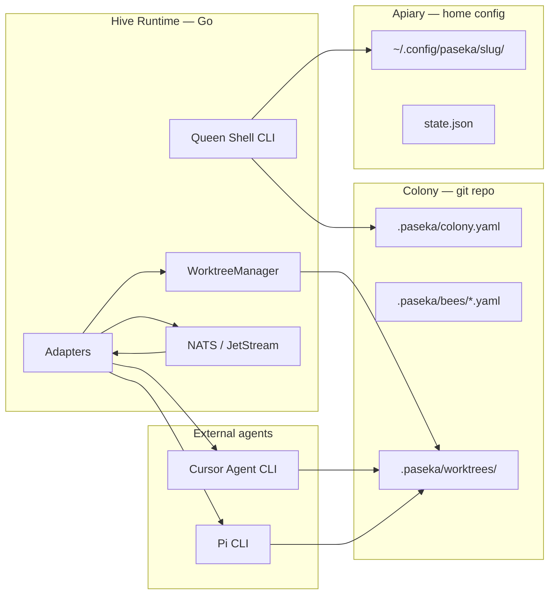

# Architecture overview

Adapters, run IPC, worktrees / code proposals, end-to-end flow, and Go package layout.

Colony config layout and `paseka init`: [Colony layout](../guide/colony-layout.md).

## 1. Agent adapters

An **adapter** is a thin driver: prepare workspace → invoke external tool → normalize result → emit bus events.

Paseka does **not** implement agents. It launches ready-made solutions with the right cwd, prompt, and parameters.

### Adapter interface (Go)

```go
type Adapter interface {
    Name() string
    Run(ctx context.Context, req RunRequest) (*RunResult, error)
}

type RunRequest struct {
    Bee        string
    Prompt     string
    ColonyRoot string            // git root — runs/ always under colony
    Workspace  string            // cwd for adapter (repo root or worktree)
    Params     RunParams
    TraceID    string            // flight trail for the whole task chain
    AgentID    string            // unique id per spawned agent
}

type RunResult struct {
    Status   string            // completed | failed | cancelled
    Output   string            // stdout / final assistant text
    Artifacts []Artifact       // diffs, logs, structured JSON
    ExitCode int
}
```

Adapters live under `internal/adapters/<name>/`. Registration is declarative via `adapter` field in bee config.

### 1.1 File-based agent IPC (`runs/`)

Each spawned agent gets an isolated directory under the **colony root** (not inside a worktree), so results survive worktree cleanup and multiple agents can share one `traceId`.

```
.paseka/runs/<traceId>/<agentId>/
├── prompt.txt         # runtime → agent: rendered prompt_template (audit / replay)
├── system.txt         # optional — rendered system_template (adapter injection)
├── result.txt         # runtime log: human-readable summary (not a success contract)
├── meta.json          # runtime → observers: bee, adapter, workspace, startedAt
├── status.json        # runtime → observers: completed|failed, exitCode, finishedAt
├── session.json       # interactive only: pid, state, session metadata
└── transcript.ndjson  # interactive only: dialogue audit log
```

Task ledger projection (updated by `paseka run`):

```
.paseka/runs/<traceId>/tasks/<taskId>/
├── task.md            # markdown + YAML frontmatter task snapshot
└── runs.ndjson        # links task executions to agent run directories
```

| ID | Scope | Generated by |
| -- | ----- | ------------ |
| `traceId` | Whole flight trail — one bloom/nectar chain | runtime (`colony.NewTraceID`: `trace-` + 16 hex, time-ordered) |
| `agentId` | Single adapter invocation (one `agent` process) | runtime (random hex) |

**Why colony root, not worktree:** code edits happen in `.paseka/worktrees/<traceId>/`, but agent I/O and audit trail live in `.paseka/runs/<traceId>/<agentId>/`. Prompt uses an **absolute path** to `result.txt` so Cursor CLI writing from a worktree cwd still lands in the colony runs dir.

Entire `runs/` tree is **gitignored** — ephemeral, machine-local artifacts.

Implementation: `internal/runs/` prepares directories and files; adapters may still read legacy `result.txt` content for summary normalization, but run success no longer depends on it. Runtime auto-synthesizes `INSIGHT/run.summary` when policy allows. Domain events are published by agents through `paseka event emit --stdin`, not by parsing assistant stdout.

**Event publish path (MVP):**

```text
agent -> paseka event emit --stdin -> validation -> NATS/JetStream
```

Agents build one JSON object per event, pass it on stdin, and receive machine-readable validation/publish feedback. `events.ndjson` is the per-run audit log under `.paseka/runs/<traceId>/<agentId>/`; `paseka event emit` appends there after a successful publish when the event includes the correct `traceId` and `agentId`.

**Optional MCP layer:** a future MCP tool may wrap the same validation/publish backend used by `paseka event emit`. MCP is not required for the base contract.

### Example: Cursor adapter (CLI)

**Decision:** invoke the **Cursor Agent CLI** (`agent`), not the SDK. Prototype: `fizman-parent/scripts/ai-tasks-run.sh` (tmux wrapper → simplified in Go via `exec`).

| Input (bee config + event) | Maps to `agent` flag |
| ---------------------------- | -------------------- |
| `command` (optional) | full argv; overrides `params` mapping (see [bee config](../guide/bee-config.md)) |
| `Workspace` | `--workspace <path>` (repo root or `.paseka/worktrees/<traceId>/`) |
| `Prompt` | positional prompt argument (`system_template` + task, newline-separated, when system is set) |
| `params.model` | `--model <id>` |
| `params.trust` (default true) | `--trust` |
| `params.force` (default true) | `--force` |
| `params.output_format` (default `stream-json`) | `--output-format stream-json` |
| `params.mode: plan` | `--plan` |
| API key | `CURSOR_API_KEY` env or `--api-key` from home config |

Default non-interactive invocation (same spirit as fizman script):

```bash
agent -p --trust --force \
  --workspace "$WORKSPACE" \
  --output-format stream-json \
  "$PROMPT"
```

**Result collection:**

1. **Process outcome** — adapter reports exit/cancel status; runtime may downgrade via `completion_contract` and per-bee `run_summary` policy.
2. **Run summary** — runtime auto-publishes `INSIGHT/run.summary` when allowed and missing; agents may emit it explicitly via `paseka event emit`.
3. **Log artifact** — runtime writes normalized summary to `result.txt` for human inspection.
4. **Git diff** — after `agent` exits, capture a **baseline-attributed** tracked diff in the **workspace** (worktree or repo root). Pre-existing dirty files are not attributed to the run.
5. **Stream JSON** — stdout when `output_format: stream-json` (lifecycle/diagnostic parse only; domain events are not extracted from assistant text). When the final `result` line includes `usage` (`inputTokens`, `outputTokens`, `cacheReadTokens`, `cacheWriteTokens`), the adapter persists it on `result.json` as optional `usage` (source `cursor.stream-json`). Adapters without usage omit the field; Honey Reserve (`energyToken`) stays dispatch-count based and is unrelated.
6. **status.json** — runtime records exit code and outcome for `paseka inspect` / Queen Console.

Go implementation: `internal/adapters/cursor/` runs `agent` with `exec.CommandContext` (no tmux — process wait replaces the shell's `tmux wait-for` pattern).

Optional: Cursor's built-in `--worktree` flag exists but Paseka prefers **`.paseka/worktrees/<traceId>/`** under colony control for HITL merge/reject.

### Example: Pi adapter (CLI)

**Decision:** invoke the **Pi CLI** (`pi`) for bees configured with `adapter: pi`. AFK runs use `pi -p`; interactive sessions use `pi` under a Paseka-owned PTY (see [interactive sessions](../guide/interactive-sessions.md)).

| Input (bee config + event) | Maps to `pi` flag |
| ---------------------------- | ----------------- |
| `command` (optional) | full argv; overrides `params` mapping (see [bee config](../guide/bee-config.md)) |
| `Workspace` | process cwd |
| `Prompt` | positional prompt argument |
| `params.model` | `--model <pattern>` |
| `params.provider` | `--provider <name>` |
| `params.thinking` | `--thinking <level>` |
| `params.output_format` | `--mode <mode>` (AFK only; see below) |
| `params.plan` | `--plan` |
| `params.binary` | CLI binary name (default `pi`) |
| API key | `api_key_env` from `~/.config/paseka/<slug>/adapters/pi.yaml` → `--api-key` |

**`output_format` → `--mode` (AFK only):**

| `params.output_format` | Pi `--mode` |
| ---------------------- | ----------- |
| `text` | `text` |
| `json` | `json` |
| `rpc` | `rpc` |
| empty or any other value | `json` (default) |

Default non-interactive invocation:

```bash
pi -p --mode json \
  --model "$MODEL" \
  --provider "$PROVIDER" \
  "$PROMPT"
```

**Ignored params:** Pi does not map Paseka `trust` or `force` (no equivalent flags).

**Result collection:**

1. **Process outcome** — adapter reports exit/cancel status; runtime may downgrade via `completion_contract` and per-bee `run_summary` policy.
2. **Run summary** — runtime auto-publishes `INSIGHT/run.summary` when allowed and missing; agents may emit it explicitly via `paseka event emit`.
3. **Log artifact** — runtime writes normalized summary to `result.txt` for human inspection.
4. **Git diff** — after `pi` exits, capture a **baseline-attributed** tracked diff in the **workspace** (worktree or repo root).
5. **Stdout** — raw stdout is preserved as an artifact. In `json`/`rpc` modes the adapter tolerantly extracts a human summary from common JSON fields (`summary`, `output`, `text`, etc.) for `result.txt` only.
6. **status.json** — runtime records exit code and outcome for `paseka inspect` / Queen Console.

**Event publishing boundary:** Pi stdout/JSON is **not** parsed into domain bus events (`SIGNAL`, `INSIGHT`, `MUTATION`, `VERIFICATION`). Agents must publish domain events explicitly via `paseka event emit --stdin` — same contract as Cursor.

**Machine-local config** (`~/.config/paseka/<slug>/adapters/pi.yaml`):

```yaml
binary: pi
api_key_env: GEMINI_API_KEY   # optional; passed as --api-key when set in env
```

If the file is missing, defaults are `binary: pi` and no API key injection.

Example bee config:

```yaml
# .paseka/bees/scout.yaml
role: scout
adapter: pi
params:
  model: gemini-2.5-pro
  provider: google
  thinking: high
  output_format: json
prompt_template: scout.md
```

Go implementation: `internal/adapters/pi/`.

### Script adapter (bash / python / custom)

**Decision:** bees with `adapter: script` run a **declared command** (bash, python, Go binary, etc.) instead of an LLM CLI. Use for deterministic eval bees (oracle guard, fault-injecting builder), CI hooks, and other signal-driven automation.

Script bees are **AFK-only** (`paseka bee run`); `bee chat` remains LLM-only.

```yaml
# .paseka/bees/oracle-guard.yaml
role: oracle-guard
adapter: script
command: ./scripts/oracle-guard.sh
run_summary: disabled
subscribes:
  - type: MUTATION
    kind: code.proposal.isolated
    dispatch: direct
publishes:
  - type: VERIFICATION
    kind: verification.success
  - type: VERIFICATION
    kind: verification.failed
```

**Requirements:**

- `command:` is **required** (shell-like string or YAML argv list).
- `prompt_template` is **optional** — when omitted, no colony default is applied; when set, the rendered prompt is written to `prompt.txt` and available as `$PROMPT`.
- `params` are ignored (runtime logs a warning if both `command` and `params` are set).

**Process environment** (in addition to `command` variable substitution):

| Variable | Value |
| -------- | ----- |
| `PASEKA_TRACE_ID` | current `traceId` |
| `PASEKA_AGENT_ID` | this invocation id |
| `PASEKA_TASK_ID` | task id when dispatched from ledger |
| `PASEKA_WORKSPACE` | adapter cwd (repo root or worktree) |
| `PASEKA_COLONY_ROOT` | git repo root |
| `PASEKA_RUN_DIR` | `.paseka/runs/<traceId>/<agentId>/` |
| `PASEKA_BEE` | bee role name |
| `PASEKA_EVENT_LOG` | path to `events.ndjson` |
| `PASEKA_RESULT_FILE` | path to `result.txt` |
| `PASEKA_PROMPT_FILE` | path to `prompt.txt` |

**Emitting events:** scripts publish domain events the same way LLM agents do — pipe JSON to `paseka event emit --stdin`:

```bash
paseka event emit --stdin <<EOF
{"traceId":"$PASEKA_TRACE_ID","agentId":"$PASEKA_AGENT_ID","type":"VERIFICATION","payload":{"kind":"verification.failed","summary":"tests failed"}}
EOF
```

**Run outcome:**

1. Non-zero exit → `failed` status (same as LLM adapters).
2. Stdout (trimmed) → run summary when non-empty.
3. Git diff in workspace → auto `MUTATION/code.proposal.isolated` or `code.proposal.root` when the bee declares the matching kind in `publishes` (worktree ↔ kind invariant; see §2).
4. Domain events are **not** synthesized from exit codes — the script must call `paseka event emit`.

Go implementation: `internal/adapters/script/`.

Future adapters (same contract): `aider`, custom wrappers.

### 1.2 Interactive sessions (HITL)

For human-in-the-loop dialogue, Paseka uses a **parallel** session path alongside one-shot `Adapter.Run()`. See [interactive sessions](../guide/interactive-sessions.md).

| Mode | CLI | Adapter API |
| ---- | --- | ----------- |
| AFK | `paseka bee run <role>` | `Adapter.Run()` — Cursor: `agent -p`; Pi: `pi -p` |
| Interactive | `paseka bee chat <role>` | `SessionAdapter.SessionCommand()` — Cursor: `agent` without `-p`; Pi: `pi` without `-p`/`--mode`, PTY-owned by runtime |

Interactive runs add `session.json` and `transcript.ndjson` under the same `.paseka/runs/<traceId>/<agentId>/` tree. Active sessions are registered in `~/.config/paseka/<slug>/state.json`. Terminal UI (default terminal vs Ghostty) is configured in `~/.config/paseka/<slug>/terminal.yaml`.

---

## 2. Worktrees and code proposals

Code changes flow through two **proposal paths** distinguished by workspace provenance. Invariant: **a guard bee always reviews the same workspace that produced the diff.** See [specs/008-code-proposal-workspaces.md](../specs/008-code-proposal-workspaces.md).

| Path | Publisher | `MUTATION` kind | Reviewer cwd | Human approve |
| ---- | --------- | --------------- | ------------ | ------------- |
| **Isolated** | `builder` (`worktree: true`) | `code.proposal.isolated` | `.paseka/worktrees/<traceId>/` (+ sector) | Merge trace worktree when present (`review: final` / `_review`); AFK commit-gate defer |
| **Root** | `hivewright` (`worktree: false`) | `code.proposal.root` | Colony root (+ sector) | **R1** soft ack only — no worktree merge, no auto-commit |

Bare `code.proposal` in bee YAML is an **alias of `code.proposal.isolated`**; runtime normalizes it on auto-publish write. Subscribers of `code.proposal` or `code.proposal.isolated` match isolated events; `code.proposal.root` subscribers do not.

### Isolated path (trace worktree)

```
SIGNAL / INSIGHT on bus
        │
        ▼
  Bee assigned (e.g. builder + worktree: true)
        │
        ▼
  WorktreeManager.Create(traceId, baseBranch)
        │  → .paseka/worktrees/<traceId>/  (gitignored)
        ▼
  Adapter.Run(Workspace = worktree path)
        │
        ▼
  Baseline-attributed git diff in worktree
        │
        ▼
  Publish MUTATION/code.proposal.isolated (+ provenance)
        │
        ▼
  guard (same worktree, direct dispatch) reviews disk
        │
        ▼
  Human review → approve (merge when final gate) | reject
```

### Root path (colony checkout)

```
task.ready → hivewright (worktree: false, cwd = colony root)
        │
        ▼
  Baseline-attributed git diff on colony root
        │
        ▼
  Publish MUTATION/code.proposal.root (+ provenance)
        │
        ▼
  main-guard (colony root, direct dispatch) reviews disk
        │
        ▼
  review: required → waiting_review (R1 ack; no merge)
```

Root proposals do **not** open the AFK receiver commit-gate defer (`waiting_review` for merge only applies to isolated proposals). Beekeeper commits root changes manually.

### Shared details

**Default worktree location:** `.paseka/worktrees/<traceId>/` — colocated with colony, simple paths for adapters, listed in `.gitignore`.

**Branch:** `paseka/<traceId>` (registered in machine-local `state.json`).

**Direct dispatch workspace affinity:** isolated (+ alias) → ensure/reuse trace worktree (prefer existing dirty tree over fresh HEAD); root → colony root, never call worktree ensure.

**Auto-publish:** runtime publishes a proposal only when the bee explicitly declares the matching kind in `publishes` and `worktree` matches the kind. Empty `publishes` never auto-publishes (fail closed). Mismatch → skip + warn; hard mismatches are `paseka doctor` errors (see [bee config](../guide/bee-config.md)).

**Merge preview:** before approving an **isolated** final merge gate (`review: final` / `_review`), Queen Console loads a three-dot diff of `defaultBranch...paseka/<traceId>` via `worktree.MergeDiff` and `GET /api/traces/:traceId/merge-diff` (unified patch + `--stat`, truncated at 1 MiB). See [specs/002-queen-console-mvp.md](../specs/002-queen-console-mvp.md).

**Registry:** `~/.config/paseka/<slug>/state.json` tracks active worktrees, base SHA, branch, and linked `traceId` for cleanup on `paseka doctor`.

Commands (later): `paseka worktree list`, `paseka worktree clean`.

---

## 3. End-to-end flow

A single `traceId` may contain multiple tasks (`taskId`) managed by the Task Ledger. See [task ledger](../reference/task-ledger.md) for the `task.plan → task.ready → task.completed` protocol.



---

## 4. Package layout (target)

```
cmd/paseka/                 # Queen Shell
internal/
  colony/                   # load .paseka + home config, slug resolution
  prompts/                  # load + render .paseka/prompts/*.md templates
  runs/                     # .paseka/runs/<traceId>/<agentId>/ layout + meta/status
  adapters/                 # adapter registry + cursor/, pi/, …
  sessions/                 # interactive PTY sessions, terminal attach
  worktree/                 # create, diff, merge, cleanup
  bus/                      # NATS, message contracts
  runtime/                  # dispatch: colony → prompts → adapter (AFK)
```

---

## 5. Decisions (locked)

| Topic | Decision |
| ----- | -------- |
| Worktree path | `.paseka/worktrees/<traceId>/` — colony-managed; registry in home `state.json` |
| Cursor invocation | Cursor Agent CLI (`agent`) — port of `ai-tasks-run.sh` pattern |
| Pi invocation | Pi CLI (`pi`) — AFK `pi -p`, interactive PTY; see §1 Pi adapter |
| Supported adapters | `cursor` (default), `pi` — selected per bee via `adapter:` in `bees/*.yaml` |
| Agent run IPC | `.paseka/runs/<traceId>/<agentId>/` — file-based; entire `runs/` gitignored |
| Prompt templates | `.paseka/prompts/` — committed; bee YAML references `prompt_template` and optional `system_template` |
| Commit `.paseka/` | yes by default; `.gitignore` covers `worktrees/`, `runs/`, `*.local.yaml`, `cache/` |
| Slug in colony.yaml | written at `paseka init`, reused on every run |
| Interactive sessions | separate `SessionAdapter`; PTY in `internal/sessions/`; see [interactive sessions](../guide/interactive-sessions.md) |
| Terminal UI for HITL | `~/.config/paseka/<slug>/terminal.yaml` — `default` or `ghostty` |

### `.paseka/.gitignore` (created by `paseka init`)

```
worktrees/
runs/
*.local.yaml
cache/
```
