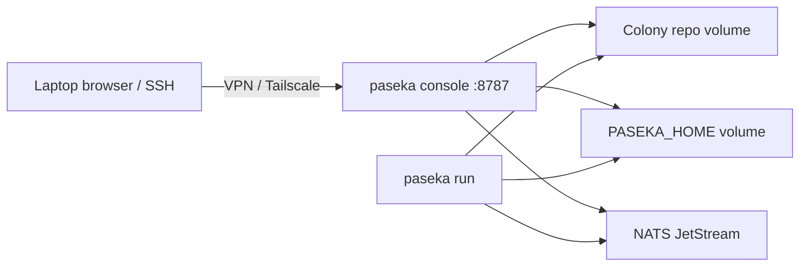

# Homelab / server deployment

Run Paseka on a separate machine (homelab NAS, mini-PC, always-on VPS on a private network) as a long-lived **apiary**: colony repo on disk, NATS with JetStream nearby, Queen Console reachable from your laptop over VPN/Tailscale.

This is not a multi-tenant cloud control plane. Queen Console still has **no authentication** — treat the host as a trusted workstation you SSH into or tunnel to.

Container files: [`docker/dev/`](../../docker/dev/) ([README](../../docker/dev/README.md)).

## What you get

| Piece | Role on the server |
| ----- | ------------------ |
| Colony git repo | Source of truth (bind-mounted into the container) |
| `~/.config/paseka/<slug>/` | Machine-local secrets, adapter config, session state |
| NATS + JetStream | Event bus (reuse an existing server or run the root [`docker-compose.yml`](../../docker-compose.yml)) |
| Cursor Agent CLI + `CURSOR_API_KEY` | Default adapter for bees |
| `paseka` binary | Prebuilt in the image; Go toolchain included to rebuild |
| Queen Console | Default container command — web UI + API on port `8787` |



## Prerequisites

- Docker Engine + Compose plugin on the server
- A colony repository already initialized (`paseka init`), or plan to init inside the container
- NATS with JetStream reachable from the container (host port `4222`, LAN IP, or another container network)
- A Cursor API key for headless `agent` runs ([cursor.com/settings](https://cursor.com/settings))

Optional on the same host: start the repo-root NATS stack:

```bash
docker compose -f docker-compose.yml up -d
```

## Quick start (container apiary)

On the server, from a clone of this repository:

```bash
cd docker/dev
cp .env.example .env
```

Edit `.env`:

| Variable | Meaning |
| -------- | ------- |
| `PASEKA_REPO` | Absolute host path to the colony git repo |
| `PASEKA_HOME` | Absolute host path mounted as `/home/dev/.config/paseka` |
| `CURSOR_API_KEY` | Cursor Agent key |
| `PASEKA_NATS_URL` | NATS URL (overrides `nats.url` in home `config.yaml`) |
| `PASEKA_CONSOLE_PORT` | Host port published to Queen Console (default `8787`) |
| `DEV_UID` / `DEV_GID` | Match the user that owns the bind mounts |

```bash
docker compose up --build
```

Default process is:

```text
paseka console --addr 0.0.0.0:8787
```

Open `http://<server>:8787` only on a trusted network (localhost, Tailscale IP, or an SSH tunnel). Do not expose Queen Console to the public internet without an auth front door you trust.

### Environment override for NATS

Non-empty `PASEKA_NATS_URL` wins over `nats.url` in `~/.config/paseka/<slug>/config.yaml`. See [CLI — NATS dependency](cli.md#nats-dependency).

Examples:

```bash
# NATS on the Docker host (compose adds host.docker.internal)
PASEKA_NATS_URL=nats://host.docker.internal:4222

# NATS elsewhere on the LAN
PASEKA_NATS_URL=nats://192.168.1.10:4222
```

## `colony_root` must match the container path

Home config stores an absolute `colony_root`. Inside the container the repo is always:

```text
/home/dev/workspace
```

Do **not** mount a laptop home config whose `colony_root` points at `/Users/...` or `/home/you/Projects/...` — resolve will fail.

Recommended pattern for a server:

1. Use a **dedicated** `PASEKA_HOME` on the server (for example `/var/lib/paseka/config`), not a copy of your laptop `~/.config/paseka` without editing paths.
2. First boot: open a shell and init (or fix `colony_root`):

```bash
docker compose run --rm --entrypoint bash paseka-dev
paseka init   # writes colony_root: "/home/dev/workspace"
```

3. Keep `PASEKA_NATS_URL` in compose for the live NATS address so you do not hard-code hostnames into the yaml for every environment.

## Typical day-to-day

### Queen Console only

```bash
docker compose up
```

Use Reviews, agents, and trace views from the browser. Console itself does not require NATS; bus-backed panels need a reachable JetStream.

### Reactor on the same machine

Run the choreography loop in a second process (second compose service, `docker compose run`, or systemd on the host):

```bash
docker compose run --rm --entrypoint paseka paseka-dev run
```

Both processes must share the same `PASEKA_REPO`, `PASEKA_HOME`, and `PASEKA_NATS_URL`.

### AFK / HITL from the container

```bash
docker compose run --rm --entrypoint bash paseka-dev
paseka bee run scout --body "survey health endpoints"
paseka doctor
```

Interactive `bee chat` / Ghostty attach assume a usable TTY on that machine — fine over SSH, awkward through Console alone. For remote HITL, prefer [Telegram gateway](telegram-gateway.md) or SSH into the apiary.

## Volumes (summary)

| Host (compose env) | Container | Contents |
| ------------------ | --------- | -------- |
| `PASEKA_REPO` | `/home/dev/workspace` | Colony git tree, `.paseka/` |
| `PASEKA_HOME` | `/home/dev/.config/paseka` | Per-slug `config.yaml`, adapters, `state.json` |
| `CURSOR_HOME` | `/home/dev/.cursor` | Cursor Agent / IDE state |
| `CURSOR_CONFIG` | `/home/dev/.config/cursor` | e.g. `auth.json` |

`CURSOR_API_KEY` is enough for headless auth; mounting Cursor config dirs is optional convenience when you already logged in on that host.

## Security notes

- Queen Console has **no login**. Bind to Tailscale/VPN, SSH port-forward (`ssh -L 8787:127.0.0.1:8787 server`), or a reverse proxy with auth — not a public `:8787`.
- Keep `CURSOR_API_KEY` and telegram tokens in `.env` / secret store; never bake them into the image.
- Match `DEV_UID`/`DEV_GID` to the owner of bind mounts so worktrees and run artifacts are not root-owned on the host.

## Rebuild `paseka` inside the container

The image already contains a binary at `/usr/local/bin/paseka`. To pick up local Go changes from the mounted repo:

```bash
docker compose run --rm --entrypoint bash paseka-dev -lc \
  'go build -o /home/dev/workspace/paseka ./cmd/paseka && ./paseka console --help'
```

Or rebuild the image (`docker compose build`) so `/usr/local/bin/paseka` is refreshed.

## Related

- [Colony layout](colony-layout.md) — `.paseka/` vs machine-local home
- [CLI](cli.md) — `paseka console`, `paseka run`, `PASEKA_NATS_URL`
- [Interactive sessions](interactive-sessions.md) — HITL on the apiary
- [Telegram gateway](telegram-gateway.md) — remote human gateway without exposing Console
- Root NATS compose: [`docker-compose.yml`](../../docker-compose.yml)
- Container README: [`docker/dev/README.md`](../../docker/dev/README.md)
