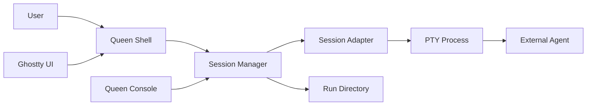

# Interactive Agent Sessions (HITL)

Paseka supports two ways to run a bee:

| Mode | CLI | Use case |
| ---- | --- | -------- |
| **AFK (one-shot)** | `paseka bee run <role> --body "…"` | Background work; runtime waits for exit, normalizes summary, and may auto-publish `INSIGHT/run.summary` |
| **Interactive (session)** | `paseka bee chat <role> "…"` | Human-in-the-loop dialogue in one long-lived agent process |

Interactive sessions are a **parallel runtime path**. They do not change the existing `Adapter.Run()` contract used for AFK runs.

**Honey reserve:** `paseka invite accept` consumes **1 honey** from the trace reserve (`energy.consume` / `session.start`). Ad-hoc `paseka bee chat` does **not** consume honey. Top up with `paseka energy add --trace <id> --amount <n>` when accept fails with honey exhausted.

See also: [architecture overview](../architecture/overview.md) (adapters, runs layout), [Brief](../idea/brief.md) (HITL paradigm).

---

## 1. Architecture



**Core rules:**

- `Adapter.Run()` stays synchronous and non-interactive (`agent -p` for Cursor).
- `SessionAdapter` only describes **how to launch** the external tool; the runtime owns the PTY, lifecycle, transcript, and status files.
- Ghostty is an optional **attach UI**, not the session primitive. Terminal preferences live in machine-local config, not in committed `.paseka/`.

**Packages:**

| Package | Role |
| ------- | ---- |
| `internal/adapters` | `SessionAdapter`, `SessionRequest`, `SessionHandle` |
| `internal/adapters/cursor` | Interactive `agent` invocation (no `-p`) |
| `internal/adapters/pi` | Interactive `pi` invocation (no `-p`, run-local session storage) |
| `internal/adapters/claude` | Interactive `claude` invocation (no `-p`) |
| `internal/sessions` | PTY process, attach, registry, Ghostty launcher |
| `internal/runs` | `session.json`, `transcript.ndjson` |
| `internal/colony` | Session registry in `state.json`, `terminal.yaml` |

---

## 2. Session adapter interface

```go
type SessionAdapter interface {
    Name() string
    SessionCommand(req SessionRequest) (SessionCommand, error)
}
```

`SessionCommand` is a plain `exec` spec: binary, args, env, working directory. The session manager starts it inside a PTY.

AFK adapters keep the existing interface:

```go
type Adapter interface {
    Name() string
    Run(ctx context.Context, req RunRequest) (*RunResult, error)
}
```

---

## 3. Run directory layout

Interactive sessions reuse `.paseka/runs/<traceId>/<agentId>/` under the **colony root** (same as AFK runs). Additional files:

```
.paseka/runs/<traceId>/<agentId>/
├── prompt.txt
├── system.txt          # optional — rendered system_template
├── summary.md
├── meta.json
├── status.json
├── request.json
├── events.ndjson
├── session.json        # live session metadata (PID, state, workspace)
└── transcript.ndjson   # NDJSON log of user/agent/system turns
```

| File | Purpose |
| ---- | ------- |
| `session.json` | `sessionId`, `traceId`, `pid`, `state` (`active` → `completed` / `failed` / `cancelled`) |
| `transcript.ndjson` | Audit trail for dialogue (`role`: `user` \| `agent` \| `system`) |

`sessionId` equals `agentId` in the MVP.

---

## 4. Session registry

Active sessions are mirrored in machine-local state:

```
~/.config/paseka/<slug>/state.json
```

```json
{
  "sessions": [
    {
      "sessionId": "a1b2c3d4",
      "traceId": "trace-…",
      "agentId": "a1b2c3d4",
      "runDir": "/path/to/repo/.paseka/runs/trace-…/a1b2c3d4",
      "bee": "scout",
      "pid": 12345,
      "startedAt": "2026-07-05T09:00:00Z"
    }
  ]
}
```

Entries are removed when the session exits. `paseka session stop` can signal the recorded PID if the session is not owned by the current shell process.

---

## 5. Queen Shell commands

### Start a chat

```bash
# Interactive session in the current terminal
paseka bee chat scout "help me design the auth flow"

# Task via template instead of positional prompt
paseka bee chat builder --body "add retry logic to the NATS client"

# Reuse a trace (e.g. continue work in the same worktree)
paseka bee chat builder --trace trace-abc123 --body "finish the PR"
```

### Session management

```bash
paseka session list              # sessions from state.json
paseka session attach <sessionId>  # attach PTY in this process only
paseka session stop <sessionId>    # stop local or remote (by PID)
```

`session attach` only works for sessions started in the **same** `paseka` process. For a separate window, use Ghostty (below) or start the session there directly.

### AFK vs chat

```bash
paseka bee run scout --body "survey the repo"   # non-interactive, exits when done
paseka bee chat scout "let's discuss the repo"  # interactive PTY session
```

---

## 6. Terminal configuration (Ghostty)

Terminal UI choice is **machine-local**:

```
~/.config/paseka/<slug>/terminal.yaml
```

```yaml
terminal: ghostty       # default | ghostty
ghostty_binary: ghostty # optional override
```

CLI override:

```bash
paseka bee chat scout "hello" --terminal ghostty
```

**Behavior:**

| `terminal` | What happens |
| ------------ | -------------- |
| `default` (or unset) | Session runs and attaches in the **current** terminal |
| `ghostty` | Opens a Ghostty window running `paseka session run <role> …` — the full session lives in that window |

Ghostty does not own the agent process in the default path: Paseka starts the PTY and attaches stdin/stdout. With Ghostty, the child `paseka session run` process owns the PTY inside the new window.

If Ghostty is not installed, set `terminal: default` or omit `terminal.yaml`.

---

## 7. Cursor adapter (interactive)

| Input | Maps to `agent` |
| ----- | --------------- |
| `command` (optional) | full argv; overrides `params` mapping (see [architecture overview](../architecture/overview.md)) |
| `Workspace` | `--workspace <path>` |
| `SystemPrompt` + `InitialPrompt` | merged into one positional prompt (newline-separated) |
| `InitialPrompt` | task/kickoff portion before glue (no `-p`) |
| `params.model` | `--model <id>` |
| `params.force` | `--force` |
| `params.plan` | `--plan` |
| API key | `CURSOR_API_KEY` or `--api-key` from home config |

Interactive invocation:

```bash
agent --force \
  --workspace "$WORKSPACE" \
  --model composer-2.5
# positional prompt when system_template and/or task are set:
# "$PROMPT"   # system + task, newline-separated
```

When `system_template` is set and no task/prompt is given, the session starts without a positional prompt and waits for user input.

Worktrees: if the bee has `worktree: true`, the session cwd is `.paseka/worktrees/<traceId>/` (same as `bee run`).

---

## 8. Pi adapter (interactive)

Bees with `adapter: pi` launch the Pi CLI in its normal interactive UI (no `-p`, no `--mode`).

| Input | Maps to `pi` |
| ----- | ------------ |
| `command` (optional) | full argv; overrides `params` mapping (see [architecture overview](../architecture/overview.md)) |
| `Workspace` | process cwd |
| `SystemPrompt` | `--append-system-prompt <system.txt>` (file path) |
| `InitialPrompt` | positional prompt when provided |
| `params.model` | `--model <pattern>` |
| `params.provider` | `--provider <name>` |
| `params.thinking` | `--thinking <level>` |
| `params.plan` | `--plan` |
| `params.binary` | CLI binary name (default `pi`) |
| API key | `api_key_env` from `~/.config/paseka/<slug>/adapters/pi.yaml` → `--api-key` |
| `agentId` | `--session-id <agentId>` |
| run directory | `--session-dir <runDir>/pi-sessions` |

Interactive invocation:

```bash
pi --session-dir "$RUN_DIR/pi-sessions" \
  --session-id "$AGENT_ID" \
  --append-system-prompt "$RUN_DIR/system.txt" \
  --model gemini-2.5-pro \
  --provider google
# optional: "$PROMPT"
```

Pi session artifacts stay under `.paseka/runs/<traceId>/<agentId>/pi-sessions/`, tied to the current `agentId`.

**Event publishing boundary:** interactive Pi output is not parsed into domain bus events. Use `paseka event emit --stdin` during the session when the bee prompt requires bus events.

---

## 9. Claude adapter (interactive)

Bees with `adapter: claude` launch the Claude Code CLI in its normal interactive TUI (no `-p`).

| Input | Maps to `claude` |
| ----- | ---------------- |
| `command` (optional) | full argv; overrides `params` mapping (see [architecture overview](../architecture/overview.md)) |
| `Workspace` | process cwd |
| `SystemPrompt` | `--append-system-prompt-file <system.txt>` (file path, not inline) |
| `InitialPrompt` | positional prompt when provided |
| `params.model` | `--model <id>` |
| `params.plan` | `--permission-mode plan` |
| `params.binary` | CLI binary name (default `claude`) |
| API key | `ANTHROPIC_API_KEY` or `api_key_env` from `~/.config/paseka/<slug>/adapters/claude.yaml` |

Interactive invocation:

```bash
claude --append-system-prompt-file "$RUN_DIR/system.txt" \
  --model claude-opus-4-8
# optional positional kickoff when task/prompt provided:
# "$PROMPT"
```

When `system_template` is set and no task/prompt is given, the session starts without a positional prompt and waits for user input in the TUI.

---

## 10. Lifecycle

```
paseka bee chat <role> [prompt]
        │
        ▼
  Resolve colony + bee config
        │
        ▼
  Optional worktree for traceId
        │
        ▼
  Render templates → prompt.txt (and system.txt when system_template is set)
        │
        ▼
  SessionAdapter.SessionCommand()
        │
        ▼
  Start PTY process → write session.json (active)
        │
        ▼
  Register in state.json
        │
        ▼
  Attach terminal (current or Ghostty)
        │
        ▼
  User dialogues with agent in one process
        │
        ▼
  On exit → update session.json, status.json, transcript
        │
        ▼
  Unregister from state.json
```

---

## 11. MVP limitations and next steps

| Topic | MVP | Later |
| ----- | --- | ----- |
| Cross-process attach | `session attach` same process only; use Ghostty for new window | Unix socket relay for sessions started outside `paseka console` |
| Queen Console PTY | WebSocket relay for sessions owned by current `paseka console` (`GET /api/sessions/:id/pty`); launch uses interactive agent TUI (no `-p`); Sessions UI has a Widen/Restore control for full-page terminal layout | Cross-process browser attach |
| `SessionAdapter.Send` | Full PTY passthrough; no separate send API | Structured message API for web UI |
| Bee YAML `mode: interactive` | Use `bee chat` explicitly | Optional default per bee |
| NATS events | File-based audit only | Publish session lifecycle to bus |

---

## 12. Decisions (locked)

| Topic | Decision |
| ----- | -------- |
| Session vs AFK | Separate `SessionAdapter`; do not overload `Adapter.Run()` |
| Session ID | Same as `agentId` for MVP |
| Run dir | `.paseka/runs/<traceId>/<agentId>/` — shared with AFK IPC |
| Terminal config | `~/.config/paseka/<slug>/terminal.yaml` — not committed |
| Ghostty | Optional UI; `session run` runs full session inside Ghostty window |
