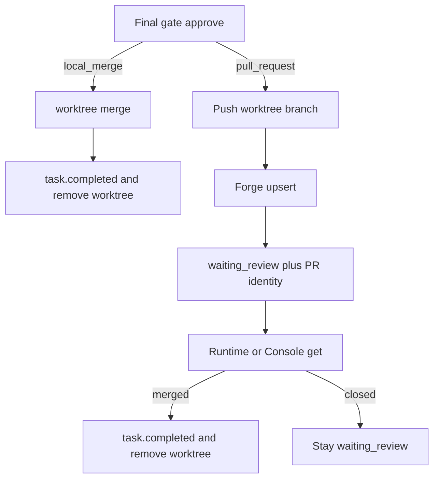

# Pull-request delivery

Isolated Flight Trails can land as a **pull request on origin** instead of a merge commit on the colony clone. Default remains **local merge**. This is the operator and colony-author source of truth; design record: [spec 024](../specs/024-pull-request-delivery.md).

Queen Console **Git** still only Fetch / Push / ff-only Pull of the **default** branch. It does not push worktree heads or open PRs. See [Queen Console](queen-console.md) and [Console Git](../specs/023-console-git.md).

## Two knobs

| Where | Field | Who shares it | Values |
| ----- | ----- | ------------- | ------ |
| Colony `.paseka/colony.yaml` | `defaults.delivery` | The repo | empty / `local_merge` (default) · `pull_request` |
| Home `~/.config/paseka/<slug>/config.yaml` | `forge.command` | This apiary | argv prefix of an executable (not a bee adapter) |

Unknown `defaults.delivery` values fail `LoadColony` and `paseka doctor`. Tokens never go in YAML — `tea` / `gh` keep their own login. `paseka init` comments an example `forge.command` in home config.

```yaml
# .paseka/colony.yaml
defaults:
  delivery: pull_request   # omit or local_merge for today's merge-on-approve
```

```yaml
# ~/.config/paseka/<slug>/config.yaml
forge:
  command: ["/absolute/path/to/examples/forge/tea.sh"]
  # or: ["/absolute/path/to/examples/forge/gh.sh"]
```

Policy without origin, or without an executable `forge.command`, **fails closed**. Publish does **not** fall back to local merge.

## What bees emit

Bees describe the trail. Runtime pushes git and talks to the forge.

| Insight | Role on a PR | Notes |
| ------- | ------------ | ----- |
| `worktree.branch` | Head ref | Same resolve as merge-diff: live worktree HEAD, else registry, else insight, else `paseka/<traceId>` |
| `trace.title` | Default title | HITL `--pr-title` / Console field wins when set |
| `pr.body` | Markdown body | Last-write-wins; max 8000 after trim; not in `{{.Insights}}`; no `dispatch: direct` |

Body fallbacks: HITL `--pr-body` → latest `INSIGHT/pr.body` → `trace.summary` → empty. Title fallbacks: HITL `--pr-title` → `trace.title` → merge-subject style `paseka: merge trace <id>`.

`pr.body` is **prompt-level** on the last AFK work task (`{{.IsLastWorkTask}}` in init `emit-insight`). It is **not** a completion-contract `required` kind. Runtime does not auto-synthesize it. Payload:

```json
{
  "traceId": "trace-1",
  "agentId": "builder-01",
  "type": "INSIGHT",
  "payload": {
    "kind": "pr.body",
    "body": "## Why\nShips the isolated trail as a reviewable pull request."
  }
}
```

New colonies get that table row and must-emit block from `paseka init`. Existing Paseka prompts in this repo stay on `local_merge` and are not rewritten.

## Approve: merge vs publish

Root proposals (hivewright R1) are unchanged: ack only, no merge, no forge.

Isolated **final** gate (`review: final` / `_review`):



| Policy | Approve does | Gate after success | Worktree |
| ------ | ------------ | ------------------ | -------- |
| `local_merge` | Merge into clone default | `task.completed` | Removed |
| `pull_request` | Push **head** + forge `upsert` | Stays `waiting_review` | Kept until forge `merged` |

Request changes is unchanged. A later approve upserts the **same** head (`--force-with-lease` only on that worktree branch). `system.kill` does not close the PR on the host.

`--merge-message` is invalid under `pull_request` (error, no silent remap). Use `--pr-title`, `--pr-body`, `--draft`. Git hooks are skipped on the head push unless `--run-hooks` / the Console checkbox (`--no-verify` + `HUSKY=0` when skipping), same idea as the Git tab.

## Git push of the head

Runtime pushes `refs/heads/<resolvedBranch>` to `origin` **without** checking out default on colony root.

- First push: create, no force.
- Later non-fast-forward on that remote branch: `--force-with-lease` **only** for that ref.
- Refused: default branch, `main` / `master` / `HEAD` as a worktree head, missing origin.

Queen Console Git **Push** remains default-branch only. Homelab direction with this policy: **push the isolated head, pull default** after the forge merge (sidecar or Console ff-only Pull).

Origin-ahead of the merge base is a **warning** on the review form (`originBehindCount`), not a block and not an auto-rebase.

## Forge script contract

Forge is **not** a bee adapter: no honey, no `.paseka/runs/` directory, no `adapter: tea`. Hive Runtime execs `<command...> <op>` with cwd = colony root, JSON on stdin, one JSON object on stdout, no TTY, 60s timeout, parent env plus:

| Env | Value |
| --- | ----- |
| `PASEKA_FORGE_OP` | `capabilities` / `upsert` / `get` |
| `PASEKA_FORGE_COLONY_ROOT` | Colony root |
| `PASEKA_FORGE_TRACE_ID` | Trail id |
| `PASEKA_FORGE_HEAD` | Head branch |
| `PASEKA_FORGE_BASE` | Default / base branch |

v1 ops: `capabilities`, `upsert`, `get`. `upsert` with `found: false` is failure. `get` with no PR returns `found: false` and **exit 0**. Garbage stdout or a wrong `protocolVersion` fails closed. Git push errors and script errors stay separate messages.

Reference drivers (copy or point `forge.command` at an absolute path):

- [`examples/forge/tea.sh`](../../examples/forge/tea.sh) — Gitea `tea`
- [`examples/forge/gh.sh`](../../examples/forge/gh.sh) — GitHub `gh`

## Reconcile

`paseka run` polls about every 30s. Queen Console merge-diff GET refreshes the same path.

| Forge `get` state | Trail |
| ----------------- | ----- |
| `merged` | `task.completed` (summary includes URL) + remove worktree + drop leftover branch like Console Git 023 + drop PR identity. Only while the final gate is still `waiting_review`. |
| `closed` (not merged) | Stay `waiting_review`; UI shows `closed`. No local merge. |
| `open` | Keep waiting; identity/url updated. |

Inbound default-branch sync after a host merge stays the existing webhook sidecar / Console ff-only Pull. Paseka does not merge on the forge in v1.

## Console, CLI, Telegram

**Queen Console Reviews:** same merge-diff as today. When `defaults.delivery` is `pull_request`, the primary action is **Open PR** / **Update PR** (title, body, draft, optional run-hooks). After publish, URL and state appear on Reviews, task detail, and the worktree row. Git tab still does not push the worktree branch.

**CLI:**

```bash
paseka proposal approve --trace trace-1 --task _review \
  --pr-title "Live bees" --pr-body "## Why\n…" --draft
# optional: --run-hooks
```

**Telegram:** waiting-review cards include the PR URL once homestate knows it. Final-gate approve from the phone is still refused (same as local merge). The gate does not merge on the forge.

PR identity lives in machine-local `state.json` (`pullRequests[]` keyed by `traceId`), not ledger KV.

## Troubleshooting

| Symptom | Likely cause | Action |
| ------- | ------------ | ------ |
| Publish: no origin remote | Laptop clone or missing `origin` | Add `origin`; `pull_request` is for a clone that can push |
| Publish: `forge.command` is not configured | Home YAML still commented | Uncomment and use an **absolute** path to `tea.sh` / `gh.sh` / your wrapper |
| Forge script fails, git push succeeded | `tea` / `gh` not logged in, or stdout is not one JSON object | Login the CLI as the same user as `paseka console` / `paseka run`; keep logs on stderr |
| Protected `main` / cannot push default | Expected on homelab | Use `pull_request`; do not use Git-tab Push of default as the landing |
| Trail stays `waiting_review` after you merged | Runtime or Console not polling, or forge `get` still `open`/`found: false` | Keep `paseka run`; open Reviews. The `tea`/`gh` examples must list closed/merged PRs on `get` |
| PR closed without merge | Host closed the PR | Gate stays open; rework or reopen; Paseka will not local-merge as fallback |
| Hooks block push | Husky / `pre-push` on the apiary | Default skip-hooks; pass `--run-hooks` only when you want them |

`paseka doctor` warns when delivery is `pull_request` but origin or `forge.command` is missing.

## Related

- [Colony layout](colony-layout.md) — `defaults.delivery` vs home `forge.command`
- [Bee config](bee-config.md) — isolated vs root; forge is not an adapter
- [Prompt templates](prompt-templates.md) — `{{.IsLastWorkTask}}` and emit partials
- [CLI](cli.md) — `paseka proposal approve` flags
- [Queen Console](queen-console.md) — Reviews publish form vs Git tab
- [Homelab deployment](homelab-deployment.md) — push head, pull default
- [Telegram gateway](telegram-gateway.md) — URL on cards, no phone merge
- [INSIGHT kinds](../reference/insight-kinds.md) — `pr.body`
- [Task ledger](../reference/task-ledger.md) — final gate stays open until forge merge
- [Event contracts](../reference/event-contracts.md) · [Bee routing](../reference/bee-routing.md)
- [Architecture overview](../architecture/overview.md) — `internal/forge`, review publish
