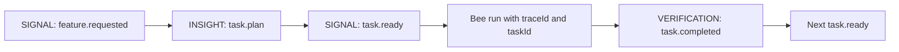

# Task Ledger Protocol

Paseka models a feature flow as a **trace** (`traceId`) containing one or more **tasks** (`taskId`). Each task may spawn one or more **agent runs** (`agentId`). The Task Ledger is the projected state of all tasks within a trace.

Implementation: [`internal/protocol/task.go`](../../internal/protocol/task.go), [`internal/taskledger`](../../internal/taskledger/).

---

## 1. Identifiers

| ID | Scope | Meaning |
| -- | ----- | ------- |
| `traceId` | Whole feature / PRD / bloom | One flight trail from initial signal through PR/merge |
| `taskId` | One subtask within a trace | A unit of work in the task queue (nectar) |
| `agentId` | One adapter invocation | A single bee run (Cursor CLI process) |

Auto-generated `traceId` values use a compact time-ordered format: `trace-` + 16 lowercase hex chars (48-bit UTC ms + 16-bit random). Lexicographic sort matches creation order. Manual ids via `--trace` (e.g. `trace-auth-01`) are allowed and need not follow this layout. See [`internal/colony/traceid.go`](../../internal/colony/traceid.go).

Relationship:

```text
traceId
  └── task-1
  │     └── agentId-a (builder run)
  │     └── agentId-b (guard run)
  └── task-2
        └── agentId-c (builder run)
```

**Important:** `RunStatus` (`completed`, `failed`, …) on an agent run is **not** the same as task completion. A task is complete only after the review/commit gate emits `task.completed`.

---

## 2. Task lifecycle



| Status | Meaning |
| ------ | ------- |
| `planned` | Task registered from `task.plan`; waiting on dependencies |
| `ready` | Dependencies satisfied; eligible for dispatch |
| `running` | Bee dispatched for this task |
| `waiting_review` | Code changed or trace gate open; awaiting guard/HITL |
| `completed` | Task gate passed (AFK success or human approval) |
| `failed` | Adapter run failed or dispatch error; retry with `paseka task retry` or Queen Console |
| `blocked` | Cannot proceed (manual intervention or honey reserve exhausted) |

Task lifecycle events use `payload.kind` inside existing top-level event types — no new `EventType` values.

### Honey reserve (`energyToken`)

Each trace carries a shared honey reserve on the task ledger snapshot:

| Field | Meaning |
| ----- | ------- |
| `energyBudget` | Initial reserve seeded from `colony.yaml` → `defaults.energy_budget` (default `12`) |
| `energyRemaining` | Tokens left; each adapter dispatch consumes `1` |

When `energyRemaining` reaches `0`, further dispatches set the task to `blocked` with summary `Honey reserve exhausted`. Top up with `paseka energy add --trace <id> --amount <n>` (`SIGNAL` / `energy.add`). Runtime audit events use `SIGNAL` / `energy.consume`.

`energy.add` only increments `energyRemaining`; it does not set `energyBudget`. Formal seeding (`SeedEnergy` / reactor dispatch) applies `defaults.energy_budget` from `colony.yaml`. Runtime-generated ledger events are applied locally before publish; the reactor skips its own JetStream echo so non-idempotent reducers (notably `energy.consume`) are not applied twice.

### Review policy

Each task may declare an optional `review` field in `task.plan`:

| `review` | Behavior |
| -------- | -------- |
| `none` (default) | No human mid-task review. Runtime auto-completes on adapter success **unless** a colony bee explicitly declares `publishes: VERIFICATION/task.completed` and the run opened an **isolated** `code.proposal` gate (builder with diff); then status stays `waiting_review` until that publisher emits `task.completed`. Scout and other no-proposal bees still auto-complete. Root proposals (`code.proposal.root`) do **not** open this AFK commit-gate defer. |
| `required` | After a successful bee run, task moves to `waiting_review` until human approval. For **isolated** proposals this follows guard verification and may include receiver defer semantics. For **root** proposals (`hivewright` → `main-guard`), `waiting_review` is a **soft ack (R1)** only — no worktree merge implied. |
| `final` | Trace-level **isolated** merge gate — activates when all other tasks complete; no AFK dispatch. **Forbidden** when the task's bee publishes `code.proposal.root` (doctor / `task.plan` load error). |

When a `MUTATION/code.proposal.*` event arrives, the ledger records `proposalWorkspace` on the task (`isolated` or `root`) from the mutation payload. Queen Console shows workspace tags on review tasks.

### Isolated merge gate vs root soft gate

| Aspect | Isolated (`code.proposal.isolated`) | Root (`code.proposal.root`) |
| ------ | ----------------------------------- | --------------------------- |
| AFK defer to receiver | Yes, when colony has `task.completed` publisher | No |
| `waiting_review` on `review: required` | After guard path (or defer) | After `main-guard` emits `verification.success` |
| `paseka proposal approve` | Merges trace worktree when `review: final` / `_review` and worktree exists | **R1:** records ack + `task.completed`; **no** merge, **no** auto-commit |
| Beekeeper commit | Via merge approve on final gate | Manual git on colony root |

When no `review: final` task is planned, the runtime synthesizes task `_review` after the last AFK task completes **only if** the trace has an isolated merge candidate: at least one task recorded `proposalWorkspace: isolated` (from `MUTATION/code.proposal.isolated`), or the trace worktree branch has a non-empty merge diff vs the default branch. Scout-only / no-diff runs do **not** open a hollow merge gate. An explicit `review: final` task with nothing to merge is auto-completed (`Nothing to merge — skipped final review gate`) instead of entering `waiting_review`.

Human actions (CLI and Queen Console Reviews use the same domain flows):

- `paseka proposal approve --trace <id> --task <id>` — **isolated final gate:** merge trace worktree when present and emit `task.completed`; **root / required soft gate:** ack only (no merge, no commit) and emit `task.completed`
- `paseka proposal reject --trace <id> --task <id>` — publish `human.feedback`; `required` tasks return to `ready` for rework
- `paseka task retry --trace <id> --task <id>` — re-publish `task.ready` for a `failed` or stuck `running` task (same bee, intent, body)

For `review: final` / `_review`, Queen Console Reviews shows an accumulated worktree merge preview (`GET /api/traces/:traceId/merge-diff`) before approve. See [specs/002-queen-console-mvp.md](../specs/002-queen-console-mvp.md).

### Adapter failure

When a `task.ready` dispatch returns a non-completed adapter result or a dispatch error, the runtime emits `SIGNAL` / `task.status` with `failed` and a summary (adapter error text or run status). Run-level `failed` in `.paseka/runs/.../status.json` and task-level `failed` are now aligned.

Retry transitions `failed` or `running` → `ready` via `task.ready`, then the reactor dispatches again when `paseka run` is active. Queen Console exposes the same flow as `POST /api/traces/:traceId/tasks/:taskId/retry`.

### `task.status` — SIGNAL

Runtime publishes intermediate task transitions (`running`, `waiting_review`, `ready`, `failed`). The `summary` field on `task.status` replaces the previous task summary (omit or empty clears it — used when unblocking honey-exhausted tasks or clearing a failure reason on retry).

```json
{
  "traceId": "trace-auth-01",
  "type": "SIGNAL",
  "payload": {
    "kind": "task.status",
    "taskId": "task-1",
    "status": "waiting_review",
    "summary": "Awaiting human review"
  }
}
```

---

## 3. Event contract

### `task.plan` — INSIGHT

Scout (or planner bee) publishes a breakdown after analyzing the initial signal.

```json
{
  "traceId": "trace-auth-01",
  "type": "INSIGHT",
  "payload": {
    "kind": "task.plan",
    "tasks": [
      {
        "taskId": "task-1",
        "title": "Add backend endpoint",
        "body": "POST /api/auth/login with JWT",
        "bee": "builder",
        "sector": "backend-users",
        "intent": "feature",
        "dependsOn": []
      },
      {
        "taskId": "task-2",
        "title": "Add login UI",
        "body": "Login form component",
        "bee": "builder",
        "dependsOn": ["task-1"]
      },
      {
        "taskId": "review",
        "title": "Human review and merge",
        "review": "final",
        "dependsOn": ["task-2"]
      }
    ]
  }
}
```

### `task.ready` — SIGNAL

Runtime or Task Reactor marks a task as ready for dispatch. Emitted when:

- A task has no dependencies and is first in the queue, or
- All `dependsOn` tasks have `status: completed`.

```json
{
  "traceId": "trace-auth-01",
  "type": "SIGNAL",
  "payload": {
    "kind": "task.ready",
    "taskId": "task-1",
    "title": "Add backend endpoint",
    "body": "POST /api/auth/login with JWT",
    "bee": "builder",
    "sector": "backend-users",
    "intent": "feature"
  }
}
```

`sector` is optional. When set, it must match a name from `.paseka/colony.yaml` `sectors`. Runtime uses it to choose the adapter workspace (module/subfolder cwd). When omitted, the bee's default `sector` applies; otherwise the colony root (or trace worktree root) is used.

`intent` is optional. When omitted, Builder Bee renders with the `general` mission partial.

### `task.completed` — VERIFICATION

Task passed the AFK gate: implement → review → commit. Use `VERIFICATION` (not agent `RunStatus`) because completion is a verified domain fact.

```json
{
  "traceId": "trace-auth-01",
  "type": "VERIFICATION",
  "payload": {
    "kind": "task.completed",
    "taskId": "task-1",
    "status": "completed",
    "summary": "Endpoint implemented, reviewed, committed",
    "commit": "abc123def",
    "completedAt": "2026-07-05T08:30:00Z"
  }
}
```

After `task.completed`, the ledger unlocks dependent tasks and may emit `task.ready` for the next item.

---

## 4. End-to-end feature flow

**Short path** (clear PRD already exists):

```text
PRD (SIGNAL: feature.requested)
  → Scout INSIGHT task.plan
  → Task Reactor: task-1 → ready
  → Builder run (traceId + taskId)
  → AFK tasks auto-complete when no colony commit-gate publisher opened an isolated code.proposal; otherwise wait for receiver task.completed
  → Review-marked tasks (`review: required`) enter waiting_review — isolated (guard/receiver) or root soft ack (main-guard)
  → All AFK tasks done → final review gate when isolated merge candidate exists (planned or synthesized `_review`); otherwise skip / auto-complete empty final
  → Human approve → merge worktree → VERIFICATION task.completed
  → Task Reactor: next task.ready (if any)
  → … repeat …
  → Trace merge gate completed
```

**Ideation path** (raw idea → grilling → spec → breakdown → same ledger): see [specs/005-feature-ideation-flow.md](../specs/005-feature-ideation-flow.md). Scout classify and Drone breakdown auto-complete on the ledger when they do not declare `code.proposal`. Drone grilling uses Human Gateway invites (not this defer gate). Scout classifies and must not emit `task.plan` for vague ideas; Drone interactive grilling produces `docs/specs/…` + `SIGNAL/spec.ready` before breakdown publishes `task.plan`.

---

## 5. Ledger interface

The `taskledger.Ledger` interface defines how trace state is stored and updated:

```go
type Ledger interface {
    Snapshot(traceID string) (TraceSnapshot, error)
    Apply(event protocol.Event) (ApplyResult, error)
}
```

**Current scope:** protocol types, pure reducer (`taskledger.ApplyEvent`), in-memory ledger for tests, and JetStream KV ledger (`taskledger.KVLedger`) used by `paseka run`. See [bee routing](bee-routing.md) for declarative bee subscriptions.

`ApplyResult.Ready` lists tasks that newly transitioned to `ready` after applying an event — the hook for a future scheduler to dispatch the next bee.

---

## 6. Runtime integration (MVP)

| Field | Where | Notes |
| ----- | ----- | ----- |
| `taskId` | `protocol.Request`, `adapters.RunRequest`, `prompts.Context` | Optional; empty for one-shot CLI runs |
| `proposalWorkspace` | `taskledger.TaskSnapshot`, Queen Console task view | `isolated` or `root`; set from opening `MUTATION/code.proposal.*` |
| `{{.TaskID}}` | Prompt templates | Available when dispatch includes a task id |
| `intent` | `task.plan`, `task.ready`, CLI `--intent` | Optional builder mission hint; normalized at prompt render time |
| Task events | `paseka event emit --stdin` | Validated CLI publish with machine-readable feedback |

CLI behavior is unchanged when `taskId` is omitted.

---

## 6.1 Filesystem task projection

The runtime mirrors each trace task into `.paseka/runs/<traceId>/tasks/<taskId>/` as a **projection** of JetStream KV state (not a second source of truth).

```text
.paseka/runs/<traceId>/
  tasks/
    <taskId>/
      task.md        # markdown + YAML frontmatter snapshot
      runs.ndjson    # agent run history for this task
```

`task.md` frontmatter stores machine-readable fields (`traceId`, `taskId`, `title`, `bee`, `status`, `dependsOn`, `summary`, `commit`, `proposalWorkspace`, `updatedAt`). The markdown body stores the human-readable task description (`body`).

`runs.ndjson` links task executions to existing agent run directories (`agentId`, `bee`, `runDir`, `startedAt`, `finishedAt`, `runStatus`).

The hive runtime updates this projection after `ledger.Apply(...)` and when task-queue dispatches start or finish.

For human-friendly task injection from the CLI, use `paseka task create` to publish `task.plan` (and optionally `task.ready` with `--autorun`). See [CLI](../guide/cli.md).

---

## 7. Related docs

- [architecture overview](../architecture/overview.md) — colony layout, adapter contract, worktrees
- [prompt templates](../guide/prompt-templates.md) — template variables including `TaskID`
- [glossary](../idea/glossary.md) — Task/Nectar, TraceID/Flight Trail
- [specs/002-queen-console-mvp.md](../specs/002-queen-console-mvp.md) — Reviews UI and merge-diff preview
- [specs/005-feature-ideation-flow.md](../specs/005-feature-ideation-flow.md) — classify → invite → grilling → `spec.ready` → breakdown before ledger work
