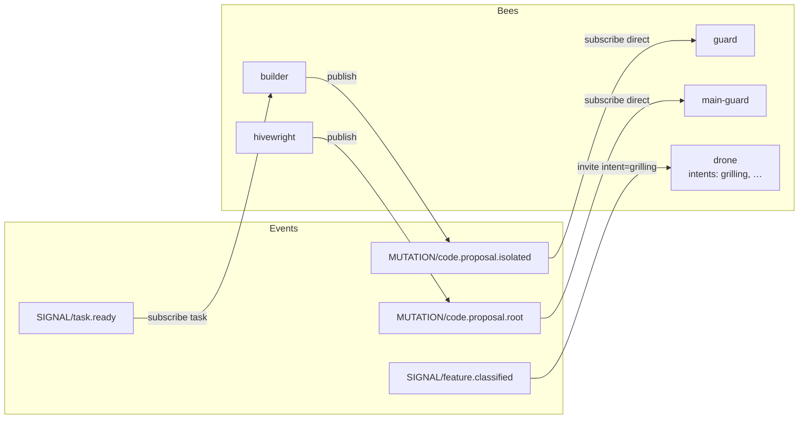

# Spec 007: Colony EDA Topology

## Status

**Implemented.** Config-derived EDA topology via `colony.BuildTopology`, Queen Console Topology tab (`GET /api/colony/topology`), and `paseka colony topology`. Part of the [002](./002-queen-console-mvp.md) MVP baseline.

## Purpose

Expose a **static, config-derived EDA topology** of the colony: how bees and colony invite rules relate to bus event kinds (`SIGNAL` / `INSIGHT` / `MUTATION` / `VERIFICATION` + `payload.kind`).

Primary UX: Queen Console **Topology** tab (interactive Cytoscape graph from structured JSON). Secondary: CLI prints the same Mermaid for docs/PRs; Console **Copy Mermaid** exposes that string.

This is an **observability** surface — not a second orchestrator and not a YAML editor.

## Goals

- Answer “what *can* happen in this colony?” from declarative config alone.
- Show bee `subscribes` / `publishes` and colony `auto_invites` on one bipartite graph.
- Keep `intent` as **prompt vocabulary annotation**, never as routing nodes/edges ([bee routing](../reference/bee-routing.md) §1, §7).
- Ship one Go projection consumed by Console API and CLI (single source of truth for Mermaid text).
- Remain useful when `paseka run` / NATS are down (filesystem colony config only).

## Non-Goals (MVP)

- Per-trace / runtime overlay (highlight edges that actually fired).
- Live NATS subscription driving the topology view.
- Editing `subscribes`, `publishes`, or `auto_invites` from the UI.
- Separate task-ledger subgraph (`task.plan` → `task.ready` → `task.completed`) beyond what already appears as bee↔event edges.
- Intent as separate nodes or intent-keyed edges.
- Enforcing advisory `publishes` (display declared rules only; runtime warnings stay as today).
- Click-through navigation from diagram nodes (optional later; not required for done).

## Current System Context

| Primitive | Location / behavior | Topology use |
| --------- | ------------------- | ------------ |
| Bee routing | `.paseka/bees/*.yaml` → `colony.LoadAllBees`, `SubscriptionRule`, `PublicationRule` | Bee↔event edges |
| Implicit subscribe | Empty `subscribes` ⇒ any `task.ready` allowed ([008](../reference/bee-routing.md) §2) | Synthetic implicit edge |
| `auto_invites` | `.paseka/colony.yaml` ([008](../reference/bee-routing.md) §7) | Invite-styled edges (not AFK dispatch) |
| Intent vocabulary | Bee YAML / `_partials/<role>-intent-*.md` via `prompts.DiscoverIntents` | Annotations on bee nodes + invite edge labels |
| `GET /api/bees` | `BeeView`: role, adapter, intents only | **Insufficient** — no `subscribes`/`publishes` |
| Console SPA | Vendored `xterm`, `diff2html`, `cytoscape` | Topology tab renders structured graph; copy Mermaid available |
| Queen Console MVP | [002-queen-console-mvp.md](./002-queen-console-mvp.md) | Observability-first; config/FS as SoT when bus down |

## Decisions

### 1. Source of truth: static colony config only

MVP topology is built **only** from:

1. `.paseka/bees/*.yaml` (excluding `*.local.yaml`)
2. `.paseka/colony.yaml` → `auto_invites`

Do **not** read JetStream replay, task-ledger KV, or run directories for the graph.

Per-trace “which edges fired?” is explicitly deferred.

### 2. Layers on the graph: bees + `auto_invites`

| Layer | On graph? | Visual |
| ----- | --------- | ------ |
| Bee `subscribes` / `publishes` | Yes | Normal bee↔event edges; label dispatch `task` / `direct` on subscribe edges |
| Colony `auto_invites` | Yes | Distinct **invite** style; edge from trigger event → target bee |
| Explicit task-ledger subgraph | No | Ledger participation already visible via `dispatch: task` on `SIGNAL/task.ready` |

Invite edges must not look like bee `subscribes` (no implication of AFK `Adapter.Run()`).

### 3. Intent is annotation only

- Bee nodes may list known intents (discovered vocabulary + default).
- Invite edges may label the rule’s default intent (e.g. `grilling`, `breakdown`).
- **No** intent nodes and **no** edges keyed by intent.

### 4. Shared projection → CLI + Console

One Go package/function builds:

1. Structured topology JSON (nodes + edges)
2. Canonical Mermaid `flowchart` string derived from that structure

Surfaces:

| Surface | Behavior |
| ------- | -------- |
| `GET /api/colony/topology` (name may vary; dedicated endpoint required) | Returns JSON including `mermaid` string |
| CLI e.g. `paseka colony topology` | Prints Mermaid to stdout; optional `--out` |
| Console **Topology** tab | Fetches API; renders structured graph with vendored cytoscape.js (pan/zoom); copy Mermaid available |

Do not extend `GET /api/bees` alone as the topology API — Bees remains a launch picker.

### 5. Implicit `subscribes`

When a bee has an empty / missing `subscribes` block, emit a **synthetic** subscribe edge:

- Event: `SIGNAL` / `task.ready`
- Dispatch: `task`
- Flag: `implicit: true` (Mermaid label must show implicit)

Bees with explicit rules do not get this synthetic edge.

### 6. Bipartite graph shape

Two node sets:

1. **Bees** — one node per loaded bee role
2. **Events** — one node per `TYPE/kind` referenced by any edge (subscribe, publish, or auto_invite `when`)

Edges only between bee ↔ event (or event → bee for invites):

| Edge kind | Direction | Meaning |
| --------- | --------- | ------- |
| `subscribe` | event → bee | Bee reacts (AFK dispatch capability / direct run) |
| `publish` | bee → event | Advisory declared output |
| `invite` | trigger event → bee | `auto_invites` publishes pending `session.invite` for that bee |

Do **not** invent bee→bee edges. Do not draw a fake “bee publishes `session.invite`” unless a bee actually declares that in `publishes`.

### 7. Console render: vendored cytoscape.js

Follow existing vendor pattern (`/vendor/...`), not CDN.

Console renders from structured `bees` / `events` / `edges` JSON (not by parsing Mermaid). API still returns the canonical `mermaid` string for CLI parity and **Copy Mermaid**.

### 8. MVP interaction

- Topology tab is **read-only**.
- Click-through from nodes is **optional** and not part of acceptance.
- No config mutation from this view.

## Suggested Mermaid sketch (illustrative)



Acceptance tests should assert on structured edges (and optionally normalized Mermaid), not pixel layout.

## API sketch

```json
{
  "bees": [
    {
      "role": "builder",
      "adapter": "cursor",
      "intents": ["general", "feature"],
      "defaultIntent": "general"
    }
  ],
  "events": [
    { "type": "SIGNAL", "kind": "task.ready", "id": "SIGNAL/task.ready" }
  ],
  "edges": [
    {
      "kind": "subscribe",
      "from": "SIGNAL/task.ready",
      "to": "builder",
      "dispatch": "task",
      "implicit": false
    },
    {
      "kind": "publish",
      "from": "builder",
      "to": "MUTATION/code.proposal.isolated"
    },
    {
      "kind": "subscribe",
      "from": "MUTATION/code.proposal.isolated",
      "to": "guard",
      "dispatch": "direct"
    },
    {
      "kind": "publish",
      "from": "hivewright",
      "to": "MUTATION/code.proposal.root"
    },
    {
      "kind": "subscribe",
      "from": "MUTATION/code.proposal.root",
      "to": "main-guard",
      "dispatch": "direct"
    },
    {
      "kind": "invite",
      "from": "SIGNAL/feature.classified",
      "to": "drone",
      "intent": "grilling",
      "match": { "decision": "grill" }
    }
  ],
  "mermaid": "flowchart LR\n..."
}
```

Exact field names may be adjusted in implementation; semantics above are normative.

## Acceptance criteria

1. Given the colony’s bee YAML + `auto_invites`, topology projection includes:
   - all bees from `LoadAllBees`;
   - subscribe/publish edges from declared rules;
   - implicit `SIGNAL/task.ready` subscribe (`task`) for bees with empty `subscribes`;
   - invite edges for each `auto_invites` rule (trigger → target bee, default intent annotated when set).
2. Intent never appears as a node or as the sole key of an edge — only as bee lists / invite labels.
3. No task-ledger-only subgraph beyond bee↔event edges.
4. `GET` topology API and CLI emit the **same** Mermaid string for the same colony root.
5. Queen Console Topology tab renders the structured graph via vendored cytoscape.js (pan/zoom) without requiring NATS/`paseka run`; **Copy Mermaid** still copies the API `mermaid` string.
6. Topology remains correct when runtime is stopped (config-only).

## Implementation outline (post-breakdown)

Not a task plan — guidance for breakdown only:

1. Go: `internal/colony` or `internal/console` topology builder from `LoadAllBees` + colony manifest.
2. HTTP: dedicated topology endpoint on Queen Console server.
3. CLI: `paseka colony topology` (or equivalent under existing colony commands).
4. SPA: Topology tab + vendored cytoscape.js; copy Mermaid source control.
5. Tests: fixture colony → golden edges / Mermaid; handler smoke test.
6. Docs: short link from [008](../reference/bee-routing.md) / Console MVP; no duplication of routing semantics.

## Related docs

- [bee routing](../reference/bee-routing.md) — `subscribes` / `publishes`, `auto_invites`, role vs intent
- [bee config](../guide/bee-config.md) — bee YAML schema
- [002-queen-console-mvp.md](./002-queen-console-mvp.md) — Console observability baseline
- [005-feature-ideation-flow.md](./005-feature-ideation-flow.md) — invite-heavy choreography example
- [006-human-gateway-invites.md](./006-human-gateway-invites.md) — invite lifecycle (not redrawn as ledger)
