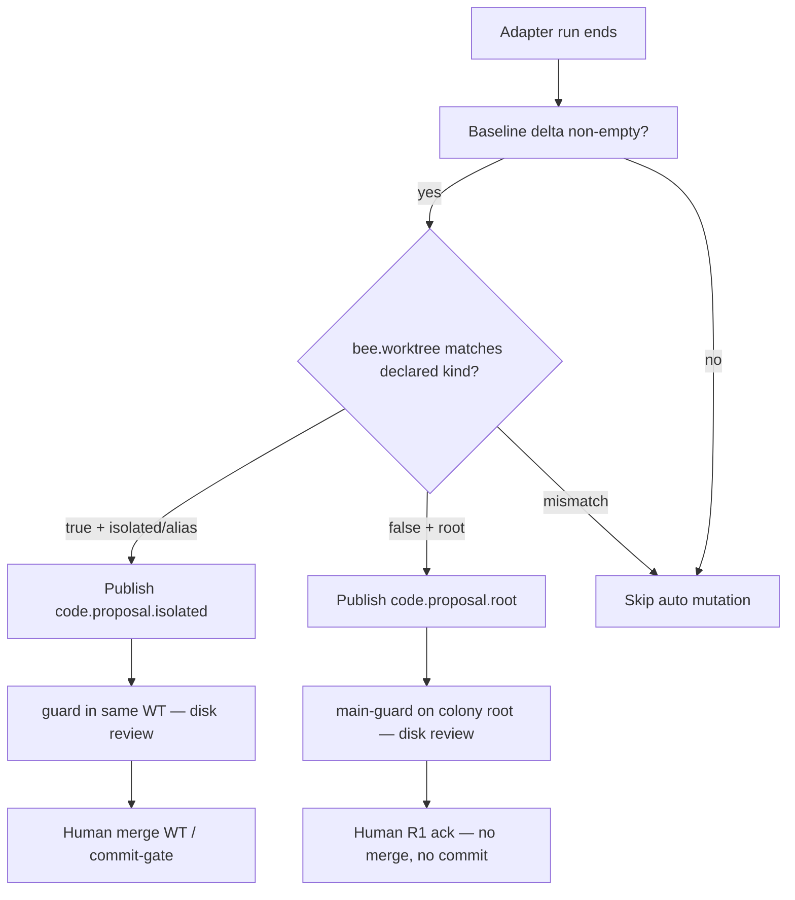

# Spec 008: Code Proposal Workspaces (isolated vs root)

## Status

**Implemented** (grilling decisions locked). Design for splitting automatic `MUTATION` code proposals by workspace provenance so worktree review and colony-root config/docs edits do not cross-contaminate.

Shipped — see [Changelog](../plans/changelog.md). Deferred follow-ups: [Backlog — Code proposal workspaces](../plans/backlog.md#code-proposal-workspaces).

## Purpose

Today a bee with `worktree: false` can dirty the **colony root**, runtime auto-publishes undifferentiated `MUTATION/code.proposal`, and a `worktree: true` guard `Ensure`s `.paseka/worktrees/<traceId>/` from `HEAD`. That worktree does **not** contain the root dirty files — review looks at the wrong disk.

This spec defines:

1. Two proposal kinds with explicit workspace provenance.
2. Hard `worktree` ↔ kind invariants for auto-publish and doctor.
3. Workspace-affine direct dispatch (reviewers always see the publisher’s disk).
4. Baseline delta so pre-existing dirt is not attributed to the run.
5. Soft human ack for root proposals (**R1**: no worktree merge, no auto-commit).
6. AFK merge / commit-gate defer only for isolated proposals.

Invariant: **a guard bee always reviews the same workspace that produced the diff.**

## Goals

- Distinguish **isolated** (trace worktree) vs **root** (colony checkout) in the bus contract.
- Auto-publish only when bee `worktree` matches the declared proposal kind.
- Reviewers consume **disk** in the publisher’s workspace (reuse existing worktree; never “create empty WT from HEAD and hope”).
- Keep AFK merge / `waiting_review` commit-gate behavior on **isolated** only.
- Support hivewright-style bees that edit `.paseka/` (and optionally `docs/`) on colony root without entering the builder→guard→merge path.
- Soft human ack for root (**R1**): approve does **not** merge a worktree and does **not** auto-commit.

## Non-Goals

| Deferred | Notes |
| -------- | ----- |
| **R2** — auto-commit on root approve | Path-scoped `git add` + commit on main |
| **R3** as default | Fully automatic root accept without human when mid-task review would otherwise apply; colonies may still use `review: none` + verification-only |
| Mandatory `proposal_paths` | Optional allowlist for root publishers; **after MVP** |
| Untracked files in proposal delta | MVP = tracked only (`git diff HEAD`); untracked follow-up |
| HITL chat-only workspace kinds | Same `worktree` knob; no chat-specific proposal kinds |
| NATS subject layout change | Still `MUTATION` + kind suffix; only payload `kind` grows |
| Console redesign | Recognize new kinds in timeline / Reviews labels; no new Reviews IA |

## Overview



| Path | Publisher | Event | Reviewer cwd | Human approve |
| ---- | --------- | ----- | ------------ | ------------- |
| Isolated | `builder` (`worktree: true`) | `code.proposal.isolated` | `.paseka/worktrees/<traceId>/` (+ sector) | Merge WT when present; existing commit-gate |
| Root | `hivewright` (`worktree: false`) | `code.proposal.root` | Colony root (+ sector) | **R1** ack only |

## Problem (current behavior)

| Step | What happens today | Why it breaks |
| ---- | ------------------ | ------------- |
| 1 | Bee with `worktree: false` + `publishes: code.proposal` runs on colony root | Allowed by config |
| 2 | Adapter captures `git diff HEAD` in cwd | Pre-existing / unrelated dirty tracked files count as “this run” |
| 3 | Runtime publishes `MUTATION/code.proposal` | No workspace provenance |
| 4 | `guard` (`worktree: true`) is direct-dispatched | `worktree.Ensure` from `HEAD` |
| 5 | Guard reviews disk in clean worktree | Diff lived on root; WT empty → false rejects / confusion |

Happy path in [architecture overview](../architecture/overview.md) assumes proposal and guard share the same trace worktree. That must become an **enforceable** invariant for isolated proposals.

## Current System Context

| Primitive | Location | Notes |
| --------- | -------- | ----- |
| Diff capture | `internal/adapters` + `gitdiff.go` | Post-run `git diff HEAD` in `req.Workspace` (tracked changes only) |
| Auto mutation | `internal/runtime/publish.go` | Always `kind: code.proposal` today |
| Eligibility | `ShouldAutoPublishMutation` / bee `publishes` | [bee routing](../reference/bee-routing.md) §5 |
| Worktree ensure | `internal/worktree`, colony dispatch | Path `.paseka/worktrees/<traceId>/`, branch `paseka/<traceId>` from `HEAD` |
| Sector | [architecture overview](../architecture/overview.md) | Optional cwd under root or under worktree |
| Guard | `.paseka/bees/guard.yaml` | `subscribes: MUTATION/code.proposal`, `worktree: true` |
| Hivewright | `.paseka/bees/hivewright.yaml` | Live colony: `worktree: false` + `code.proposal` |
| main-guard | `.paseka/bees/main-guard.yaml` | `worktree: false`; publishes `review.note`; **not** subscribed to proposals yet |
| AFK defer | `afk_completion.go` | `waiting_review` when run opened `code.proposal` and colony has `task.completed` publisher |
| Human approve | `internal/review` / `paseka proposal approve` | Merges trace worktree for final review when present, then `task.completed` |

## Decisions

### 1. Two MUTATION kinds

| Kind | Workspace | Typical publisher | Typical reviewer |
| ---- | --------- | ----------------- | ---------------- |
| `code.proposal.isolated` | `.paseka/worktrees/<traceId>/` (+ sector) | `builder` (`worktree: true`) | `guard` (`worktree: true`) |
| `code.proposal.root` | Colony root (+ sector) | `hivewright` (`worktree: false`) | `main-guard` (`worktree: false`) |

**Naming:** `root` means colony repository checkout root, not git’s default branch. Do not use `main` or `default` as kind suffixes.

### 2. Alias for compatibility

- Bare `code.proposal` remains accepted in bee YAML and on the bus as an **alias of `code.proposal.isolated`**.
- Runtime **normalizes alias → `code.proposal.isolated` on auto-publish write**.
- Subscription matching: a subscriber of `code.proposal` **or** `code.proposal.isolated` matches isolated events (after normalization). A subscriber of only `code.proposal.root` does **not** match isolated (or alias).
- `paseka doctor` / load: warn to prefer the explicit kind; alias removal is a later major cleanup (see Open questions).

### 3. Worktree ↔ kind invariant (hard)

Auto-synthesis of a proposal event:

| Bee `worktree` | Declares publish | Auto-publish kind | Else |
| -------------- | ---------------- | ----------------- | ---- |
| `true` | `isolated` or alias `code.proposal` | `code.proposal.isolated` | Skip auto mutation + warn |
| `false` | `code.proposal.root` | `code.proposal.root` | Skip + warn |
| `true` | only `root` | — | Skip + **doctor error** |
| `false` | only `isolated` / alias | — | Skip + **doctor error** |

**Fail closed:** empty / missing `publishes` must **not** auto-publish mutations. No undeclared auto proposal (deliberate break of any legacy “diff always publishes” assumption).

Manual `paseka signal` / script-emitted mutations may still use either kind; doctor does not rewrite them, but direct dispatch still applies workspace affinity (§5).

### 4. Baseline delta (both kinds)

Before adapter start, capture a workspace baseline (dirty tracked state / diff fingerprint). After exit, the published diff is **only the delta attributable to this run**.

Unrelated pre-dirty files on root must not become a proposal. Same rule inside a reused worktree.

MVP algorithm is an implementation detail (textual “diff before” vs “diff after” subtract, or `git status`/`diff` snapshot compare) as long as attribution holds in tests. **MVP includes tracked changes only** (same surface as today’s `git diff HEAD`); untracked files are a post-MVP follow-up.

### 5. Reviewers look at disk; workspace affinity

Direct dispatch for a proposal must set adapter cwd to the **same workspace class** as the event:

| Kind | Workspace resolution |
| ---- | -------------------- |
| `isolated` (+ alias) | Ensure/reuse `.paseka/worktrees/<traceId>/` (+ sector). Prefer existing entry; do **not** replace a dirty publisher worktree with a fresh HEAD tree. |
| `root` | `colonyRoot` (+ sector). **Never** call worktree ensure. |

- Prompt/task context may embed summary + truncated diff for UX; review truth is **disk** (`git diff` in workspace).
- Update guard prompts that say `git diff --staged` to match actual capture (`git diff` / workspace dirty state) in the same implementation pass.
- Rework-cycle duplicate suppression ([bee routing](../reference/bee-routing.md) §4) keys by event identity for **both** proposal kinds (and alias), so each publisher→reviewer pass can run again on the same task.

### 6. Do not materialize root diffs into a worktree

Rejected alternative: publish from root, then `git apply` into a new worktree for guard. Out of scope. Root stays on root; isolated stays on isolated.

### 7. AFK defer / merge gate only for isolated

| Event | Opens AFK `waiting_review` + receiver `task.completed` gate? | `paseka proposal approve` merge WT? |
| ----- | ------------------------------------------------------------- | ----------------------------------- |
| `code.proposal.isolated` (and alias) | Yes (unchanged semantics) | Yes, when worktree exists and final/merge path applies |
| `code.proposal.root` | **No** | **No** |

Root proposals must not block the builder-style commit-gate publisher path. Soft human review for root uses **R1** (§8), not the receiver merge gate.

### 8. Root human gate = R1 (ack)

Human gate options considered:

| Option | Behavior | MVP |
| ------ | -------- | --- |
| **R1 Soft gate** | Reviewer verifies disk; human approve = ack + completion advance; **no** WT merge; **no** auto-commit | **Chosen** |
| **R2 Commit gate** | Approve does path-scoped `git add` + commit on colony root | Deferred |
| **R3 No mid-gate** | Auto-complete after `verification.success` when `review: none` | Allowed via existing `review: none`; not forced |

**Locked decisions (grilling):**

| Decision | Choice |
| -------- | ------ |
| When root waits for human | **Only** when the task has `review: required` |
| `review: final` on a root-proposal task | **Forbidden** — doctor/load error (`final` is isolated merge-gate only) |
| `main-guard` publish contract | **Must** emit `verification.success` / `verification.failed`; `review.note` optional |
| Soft-ack ledger shape | Reuse `waiting_review` + `review: required` (no new `review: ack` enum) |

Flow when `review: required` and a root proposal is under review:

1. `main-guard` (or equivalent) reviews **disk on colony root** (+ sector) and emits `verification.success` / `verification.failed` (optional `review.note`).
2. On success, task enters `waiting_review` **without** implying a worktree merge.
3. `paseka proposal approve` (or Console equivalent) for a **root** proposal:
   - does **not** merge `.paseka/worktrees/…`
   - does **not** create a git commit
   - records human ack (summary) and publishes completion / advances ledger (`task.completed` or colony-defined follow-up)
4. `paseka proposal reject` publishes `INSIGHT/human.feedback` (same family as today); rework returns task to `ready` when configured.

When `review: none`, root path does **not** open soft-ack: after successful verification the task may complete via normal AFK rules (no receiver commit-gate — §7).

Branch approve/reject on proposal kind (or task/review metadata derived from the opening proposal), not on a separate status string.

Beekeeper remains responsible for committing root changes (manual git, or a later bee). Platform does not silently commit `.paseka/` or `docs/`.

CLI/API must branch on proposal kind so approve is safe to call without guessing.

Console: Reviews / timeline should label root vs isolated; approve on root must invoke R1 semantics. No new Reviews page required for MVP.

### 9. Colony role wiring (reference)

Target wiring after retarget:

| Bee | `worktree` | `publishes` | `subscribes` |
| --- | ---------- | ----------- | ------------ |
| `builder` | `true` | `MUTATION/code.proposal.isolated` | `task.ready` / `verification.failed` (unchanged) |
| `guard` | `true` | verification + `review.note` | `MUTATION/code.proposal.isolated` (and/or alias) `dispatch: direct` |
| `hivewright` | `false` | `MUTATION/code.proposal.root` | — |
| `main-guard` | `false` | `verification.success` / `verification.failed` (required); `review.note` optional | `MUTATION/code.proposal.root` `dispatch: direct` |

Example snippets:

```yaml
# builder — isolated only
worktree: true
publishes:
  - type: MUTATION
    kind: code.proposal.isolated

# guard
worktree: true
subscribes:
  - type: MUTATION
    kind: code.proposal.isolated
    dispatch: direct

# hivewright — root only
worktree: false
publishes:
  - type: MUTATION
    kind: code.proposal.root

# main-guard
worktree: false
subscribes:
  - type: MUTATION
    kind: code.proposal.root
    dispatch: direct
publishes:
  - type: VERIFICATION
    kind: verification.success
  - type: VERIFICATION
    kind: verification.failed
  - type: INSIGHT
    kind: review.note
```

Init templates and live colony YAML must agree: hivewright uses **root** semantics (`worktree: false` + `code.proposal.root`). Align init seeds that currently may set `worktree: true` on hivewright.

### 10. Payload provenance fields

Extend `MutationPayload` (names indicative):

| Field | Required | Notes |
| ----- | -------- | ----- |
| `kind` | yes | `code.proposal.isolated` \| `code.proposal.root` (alias normalized on auto-publish write) |
| `diff` / `ref` | one of | Same offload rules as today (>64KiB → object store) |
| `summary` | no | From run summary |
| `taskId` | no | Ledger linkage |
| `workspace` | yes on auto-publish | `isolated` \| `root` (redundant with kind; useful for projections) |
| `baseSha` | recommended | `HEAD` at baseline capture |
| `worktreePath` | isolated only | Repo-relative path when applicable |
| `sector` | no | When task/bee sector scoped the workspace |

Validators accept both new kinds; alias accepted on read.

## Event examples

### Isolated

```json
{
  "type": "MUTATION",
  "payload": {
    "kind": "code.proposal.isolated",
    "workspace": "isolated",
    "baseSha": "abc123…",
    "worktreePath": ".paseka/worktrees/trace-1",
    "taskId": "task-1",
    "summary": "Add handler",
    "diff": "diff --git a/…"
  }
}
```

### Root

```json
{
  "type": "MUTATION",
  "payload": {
    "kind": "code.proposal.root",
    "workspace": "root",
    "baseSha": "abc123…",
    "taskId": "task-cfg-1",
    "summary": "Retune hivewright bee YAML",
    "diff": "diff --git a/.paseka/bees/hivewright.yaml…"
  }
}
```

## Runtime algorithm

### Auto-publish

```text
on adapter exit (AFK):
  if bee does not explicitly declare an allowed proposal publish → skip
  delta = workspace_diff_since_baseline(req.Workspace)
  if delta empty → skip
  if bee.worktree && declares isolated/alias → publish code.proposal.isolated (+ provenance)
  else if !bee.worktree && declares root → publish code.proposal.root (+ provenance)
  else → warn/skip (invariant violation)
```

### Direct dispatch

```text
on MUTATION proposal direct dispatch:
  resolve kind (alias → isolated)
  if isolated → workspace = ensure/reuse trace worktree (+ sector); must reflect publisher edits
  if root → workspace = colony root (+ sector); never ensure worktree
  build task context; reviewer reviews disk
```

### Approve

```text
on paseka proposal approve / Console approve:
  resolve opening proposal kind for task (isolated vs root)
  if isolated → existing merge-when-WT / completion semantics
  if root → R1: no merge, no commit; ack summary + task.completed (or configured follow-up)
```

## Doctor / config checks

`paseka doctor` (or bee load) should flag:

| Severity | Condition |
| -------- | --------- |
| Error | `publishes: code.proposal.root` with `worktree: true` |
| Error | `publishes: code.proposal.isolated` (or bare `code.proposal`) with `worktree: false` |
| Error | Subscriber of isolated with `worktree: false` |
| Error | Subscriber of root with `worktree: true` |
| Error | Task (or plan entry) with `review: final` whose opening / expected proposal kind is `code.proposal.root` |
| Warn | Bare `code.proposal` alias still in use |
| Advisory | Declared publisher kind with no matching subscriber in the colony |
| Advisory | Root subscriber (`main-guard`) missing `verification.success` / `verification.failed` in `publishes` |

## Rejected alternatives

| Alternative | Why rejected |
| ----------- | ------------ |
| Auto-proposal only when `worktree: true` (no root kind) | Blocks legitimate hivewright edits on colony root |
| Materialize root diff into a fresh worktree for guard | Dual truth (payload vs disk); apply failures; fights “review disk” |
| Single kind + provenance flag only | Weak routing; easy to mis-subscribe guard to root events |
| R2 auto-commit on root approve | Too sharp for `.paseka/` / docs; beekeeper owns commit in MVP |

## Migration plan

1. Protocol + validation for new kinds; alias normalization on write; subscription match rules.
2. Baseline diff + publish kind selection; skip on mismatch; fail closed on undeclared publish.
3. Reactor workspace affinity for direct dispatch (root never ensures WT).
4. AFK defer gated on isolated only.
5. `proposal approve` / Console: branch R1 ack vs merge.
6. Retarget colony bees (`builder` / `guard` / `hivewright` / `main-guard`) + prompts + init templates.
7. Tests: publish routing, baseline attribution, no WT on root, defer matrix, approve behavior, doctor mismatches.
8. Docs pass (list below).

## Acceptance criteria

- [ ] Auto-publish never leaves bare `code.proposal` on the wire; writes normalize to `isolated` or `root`.
- [ ] Bee with empty `publishes` never auto-publishes a mutation (fail closed).
- [ ] Hivewright on colony root with dirty unrelated tracked files **before** run does not publish a proposal (baseline).
- [ ] Hivewright edits under root publish `code.proposal.root`; `guard` is **not** dispatched; no new worktree created for that event.
- [ ] `main-guard` (or configured subscriber) runs with cwd = colony root (+ sector) and can see the edits on disk.
- [ ] Builder in worktree publishes `code.proposal.isolated`; guard reuses same worktree and sees edits on disk.
- [ ] Only isolated opens AFK `waiting_review` merge/commit-gate path (receiver `task.completed`).
- [ ] Root soft-ack opens `waiting_review` **only** when `review: required` (not for every root proposal).
- [ ] `review: final` on a root-proposal task is rejected by doctor/load (error).
- [ ] `main-guard` declares and can emit `verification.success` / `verification.failed`.
- [ ] `paseka proposal approve` on root (R1): no worktree merge, no auto-commit; ledger/completion advances.
- [ ] `paseka proposal approve` on isolated: merge behavior preserved when WT present (final/merge path).
- [ ] Doctor reports worktree/kind mismatches as errors; alias use as warn.
- [ ] MVP proposal delta is tracked-only (no untracked); no `proposal_paths` filter required.
- [ ] Routing docs, bee examples, and init templates updated; alias documented.

## Open questions / follow-ups

1. **`proposal_paths`** — optional allowlist (e.g. `.paseka/`, `docs/`) for root publishers. **Deferred after MVP** (decided).
2. **Untracked files** — whether baseline/proposal should include untracked for isolated and/or root. **Deferred after MVP** (decided: tracked-only for MVP).
3. **Alias removal timeline** — when to drop bare `code.proposal` from validators.

## Docs to update when implementing

Canonical docs updated in migration step 8:

- [architecture overview](../architecture/overview.md) — worktree flow + dual proposal paths
- [bee routing](../reference/bee-routing.md) — kinds, direct path table, AFK defer scope, alias matching
- [bee config](../guide/bee-config.md) — `publishes` examples, invariants
- [task ledger](../reference/task-ledger.md) — root soft gate vs isolated merge gate
- [CLI](../guide/cli.md) — `proposal approve` R1 vs merge
- [prompt templates](../guide/prompt-templates.md) — stop saying “staged diffs only”; guard prompt disk review
- [insight kinds](../reference/insight-kinds.md) — MUTATION kind table if it lists `code.proposal`
- Init bee templates under `internal/colony` / `.paseka/bees/`
- Topology examples in [007-colony-eda-topology.md](./007-colony-eda-topology.md)

## References

- [architecture overview](../architecture/overview.md) — adapter workspace, worktree merge flow, sectors
- [bee routing](../reference/bee-routing.md) — publishes / direct dispatch / AFK defer
- [bee config](../guide/bee-config.md) — bee YAML knobs
- [task ledger](../reference/task-ledger.md) — review gates and `waiting_review`
- [CLI](../guide/cli.md) — `paseka proposal approve|reject`
- [backlog](../plans/backlog.md#code-proposal-workspaces) — deferred follow-ups; [Eval colony](../plans/backlog.md#eval-colony) — worktrees-from-`HEAD` gotcha
